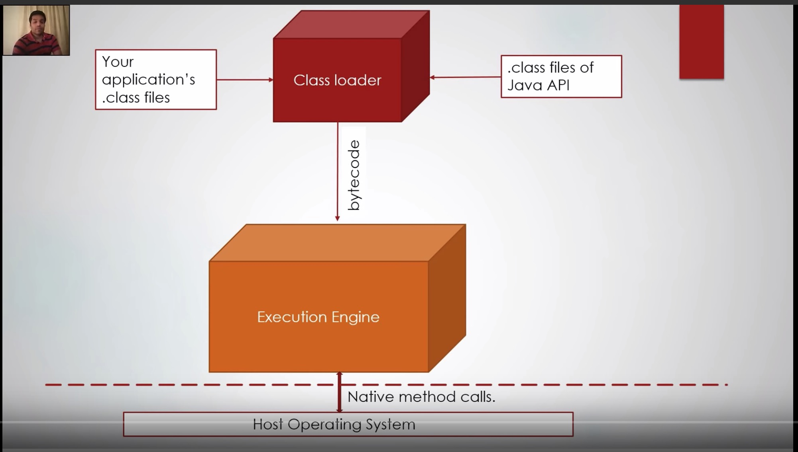
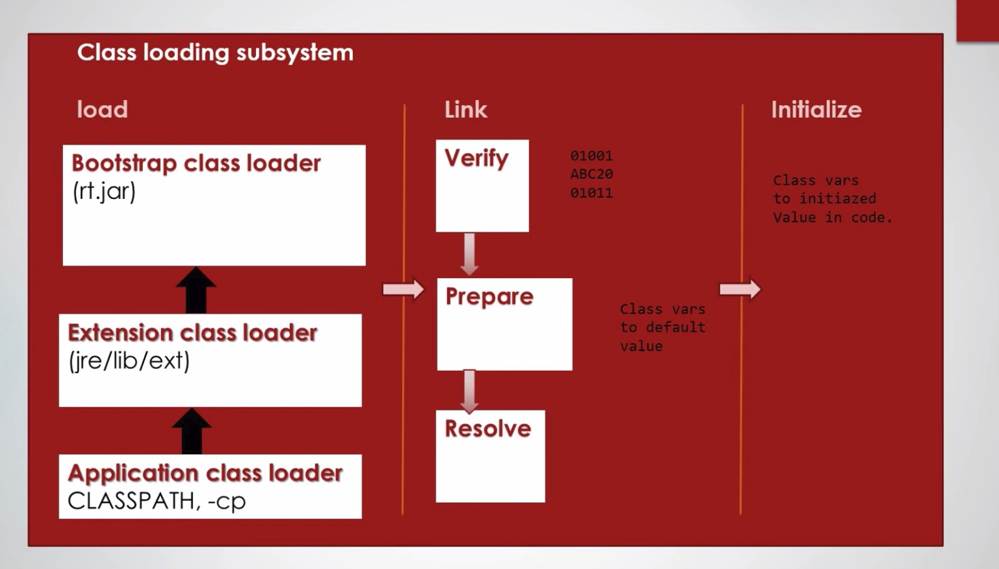
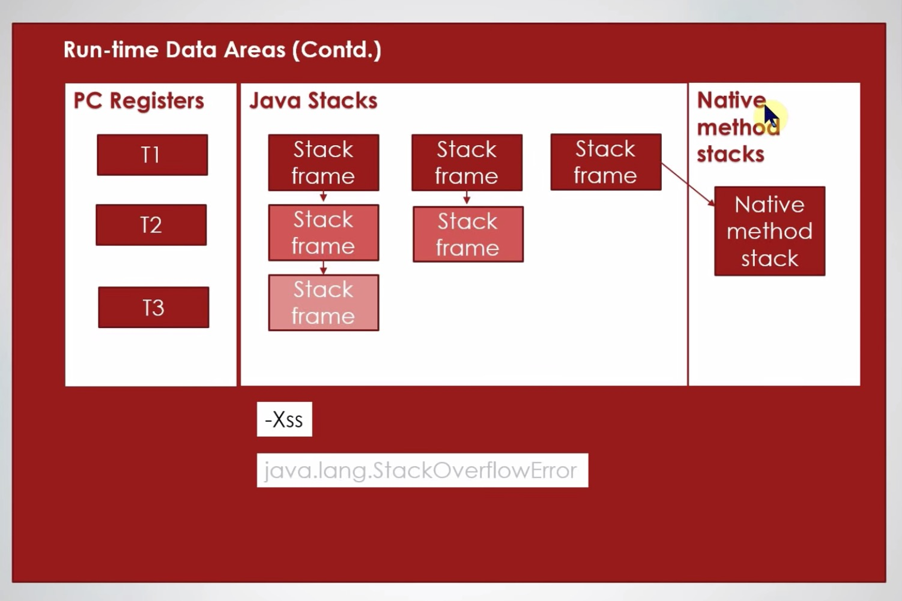
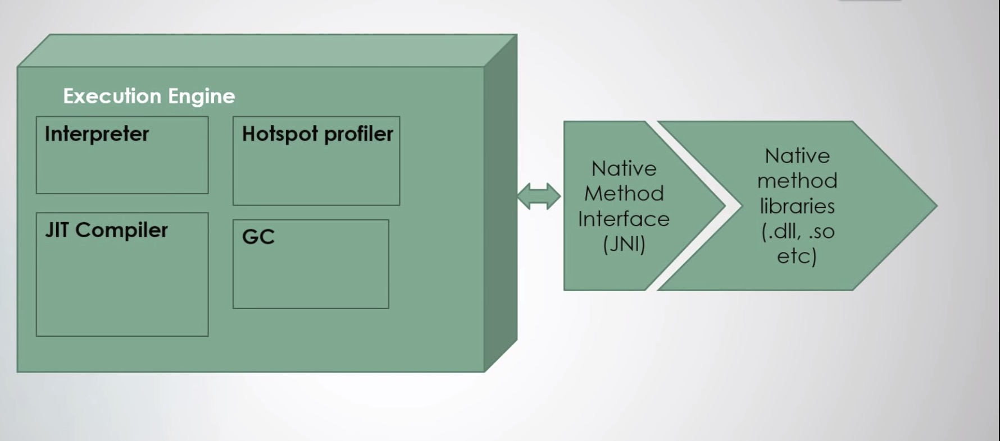

# Java

1. Versioning
    1. java 1.8 and 8 are the same thing
    1. LTS version is released every 3 years and current LTS is java 11 nad it has commercial support till 2026
    1. Next LTS version will be jdk 17
    1. All the jdk vendors follow the same versioning but the features may differ
1. Vendors
    1. Oracle
        1. Oracle is the owner of java jdk and they have both commercial and open source version of the jdk
        1. The commercial version can be used for personal use and is under the license OTN(Oracle Technology Network License).
        1. Open source version is called OpenJDK and it has GNU Classpath Exception license. GNU license generally means whatever we right ovet that license must also be shown but GNU classpath Exception License states it is not necessary to do so.
1. JVM
    1. JVM versions
        1. Hospot JVM -> this is the actual JVM and widely deployed
        1. OpenJ9 JVM -> it is open source and is used by IBM on their servers
        1. Amazon Corretto -> amazon servers use this JVM and it is open source. It also has free support.
    1. JVM architecture
        1. The main function of jvm is to load and execute class file
        1. edit .java -> compile .java -> .class file -> run in jvm instance using java
        1. java MyApp -> creates a new JVM instance
        1. 
        1. 
        1. Class Loader Subsystems
            1. 
            1. Load
                1. Bootstrap class loader -> Extension Class Loader -> Application Class Loader
                1. It is responsible for loading the byte code into the memory
            1. Link
                1. Verify -> it verifies the byte code and check compatibility with jvm
                1. prepare -> Memory is allocated for static variables. Only memory allocation for class and set to default value.
                1. resolve -> All the symbolic references in current class is resolved
            1. Initialize
                1. Initializes all the static variables as per provided in the code and static block is executed.
                1. Class def not found is occured here.
        1. Runtime Data Areas (Memory)
            1. 
            1. Method Area
                1. It is called PermGen space
                1. It is replaced by metaspace in java 8
                1. Meta data corresponding to class data is stored here
                1. Static variables and class level constants
            1. Heap
                1. It is place where object data is stored.
                1. All the instance variables, array are stored here.
                1. -Xms, -Xmx -> min size and max size
            1. 
            1. PC register
                1. Contains Program Counter Per Thread.
                1. Program counter has pointer to the next instruction.
            1. Java Stacks
                1. It contains Stack frame corresponding to current method execution per thread.
                1. Stackoverflow occurs here.
            1. Native method Stack
                1. To run dll
                1. When a method calls a native method
        1. Execution Engine
            1. 
            1. Interpreter
                1. Takes bytecode instruction and finds out wht native operation is to be done.
                1. It makes use of native method interface which inturn uses native method libraries
                1. In windows these libraries maybe dlls in linux it may be .so or .a files
                1. These can be found in jre bin folder
            1. JIT compiler
                1. Just In Time Compiler
                1. When certain instruction is executed repeatedly it won't be interpreted again and again
            1. Hotspot profiler
                1. It helps in optimizing and tells JIT what must be compiled ust in time.
1. Static nested class vs non static nested class
    1. A static nested class cannot access the non static members inside the class
    1. A non static nested class can access the non static members inside the class
1. `<T extends Comparable<T>>`
    1. This means that T can be any class that extends the comparable interface
