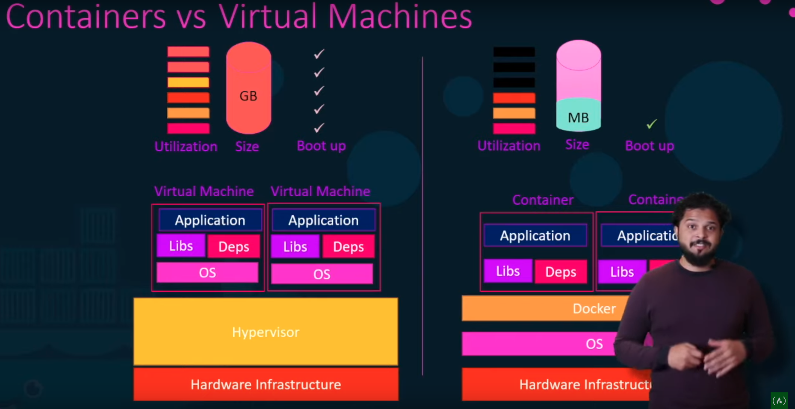
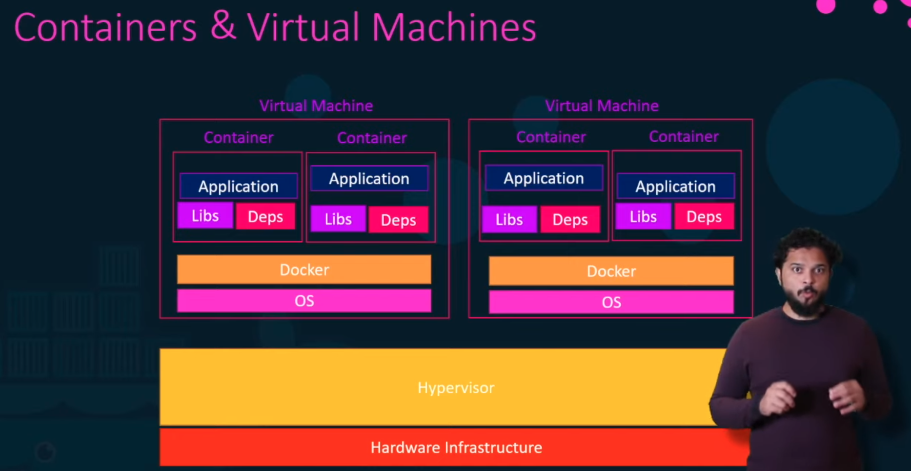
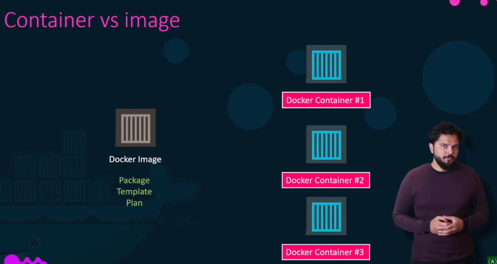

# Docker

## Intro

1. Matrix of hell
    1. Each service in an application has sperate libraries and dependancies and OS dependencies as well
    1. This makes and application or a service hard to sertup and run
    1. This dependancies to the OS is called Matrix of hell
1. Containers
    1. Containers are completely isolated environments, they can have their own processors, network interfaces etc just like VMs but they share the same kernel
    1. Types of containers
        1. Java Containers
        1. Unikernels
        1. LXD
        1. LXC
        1. OpenVZ
1. Docker Intro
    1. Docker utilizes LXC containers
    1. Setting these containers are hard as they are very low level and docker provides an high level abstraction to these containers
    1. Docker run on the OS kernel, linux hence it will be the same for all the flavours of ubuntu and other linux based OSs
    1. A linux based container won't run on a windows machine (because kernels are different)
    1. When we run a linux based container on windows or mac, it is actually run on a linux VM over windows
1. Containers VS VMs
    1. 
    1. VMs are entire OS over the hypervisor so they consume more space, take more boot up time amd utilize morre CPU
    1. Isolisation wise VMs offer better isolisation as they don't share the same kernel
1. Containers and VMs
    1. 
    1. In most of the cases we will use virtualization and docker together
    1. We can VMs to commision or decommision docker hosts and use docker to commision or decommision services or applications
1. Doker Hub
    1. Docker hub has a large set of Images that has been published by companies or individuals
    1. When we use run command dockers looks at the  docker hub to find the image, download it and loads it
1. Image vs Container
    1. 
    1. Image is a package like a VM template
    1. A container is a running version of an image

## Getting Started With Docker

1. Commands
    1. run 
        1. Runs the image if it already exsists in the local docker images repository
        1. Downloads the image from the docker hub and starts it if it is not present in the locl docker images respository
        1. If we run an ubuntu image, it starts and exits immediatly
        1. Unlike VMs containers are not meant to host machines, they are meant to run a specific task or process
        1. So something must be running to keep the container alive like an API server or a sleep command
        1. We can also specify a command to start a service with run command
        1. Example : run ubuntu sleep 5
    1. exec
        1. This command can be used to run a command on a running docker container
    1. attach
        1. When we want to attach back to a container run with -d mode 
    1. ps
        1. Lists thee information about containers currently running
        1. Each container will get a name and an ID for it assigned by docker
        1. -a will show all the ccontainers and thier status
    1. stop
        1. command used to stop a docker container
        1. Should provide a container name or id
    1. rm
        1. To remove a container
    1. images
        1. To list the images downloaded in the system
    1. rmi
        1. To remove an image
        1. No container must be running off this image
    1. pull
        1. To only download the image and not run it
