# Data Structures

## Intro

1. A data structure is a way of organizing data so that it can be used effectively.
1. Abstract Data Types VS Data Structures
    1. An Abstract data type is an abstraction of a data structure which provides only the interface to which the data structure must adhere to.
    1. It Does not indicate specific details about how something should be implemented or in what programming language.
    1. 
1. Computation Complexity
    1. How much time and space is needed?
    1. Big O
        1. Only cares about worst case.
        1. 
        1. Can ignore constants because n-> infinity(In real world this constant might matter)
        1. 
        1. 
        1. 
        1. n + (n-1) + (n-2) ... = n(n+1)/2
        1. 
        1. Multiply the loops on different levels and add the loops on the same level
        1. Examples
            1. Finding all subsets of a set -> O(2^n)
            1. Finding all permutations of a String -> O(n!)
            1. Merge Sort -> O(nlogn)
            1. Iterating a matrix -> O(nm)

## Arrays

1. Static Arrays
    1. A static array is a fixed length container containing n elements indexable from the range [0,n-1]
    1. Each slot/index in the array can be referenced with a number
    1. Contigous chunks of memory
    1. When and where is static array used?
        1. Storing and accessing sequential data
        1. Temp storing objects
        1. Used as buffers for IO
        1. Lookup tables and inverse lookup tables
        1. To return multiple values from a function
        1. Used in DP to cache answers for sub problems
    1. 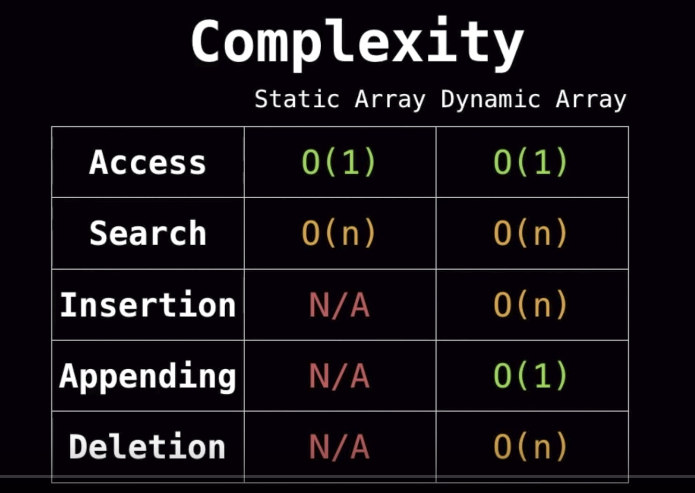
1. Dynamic Arrays
    1. Dynamic arrays can grow and shrink and can have methods like add and remove
    1. 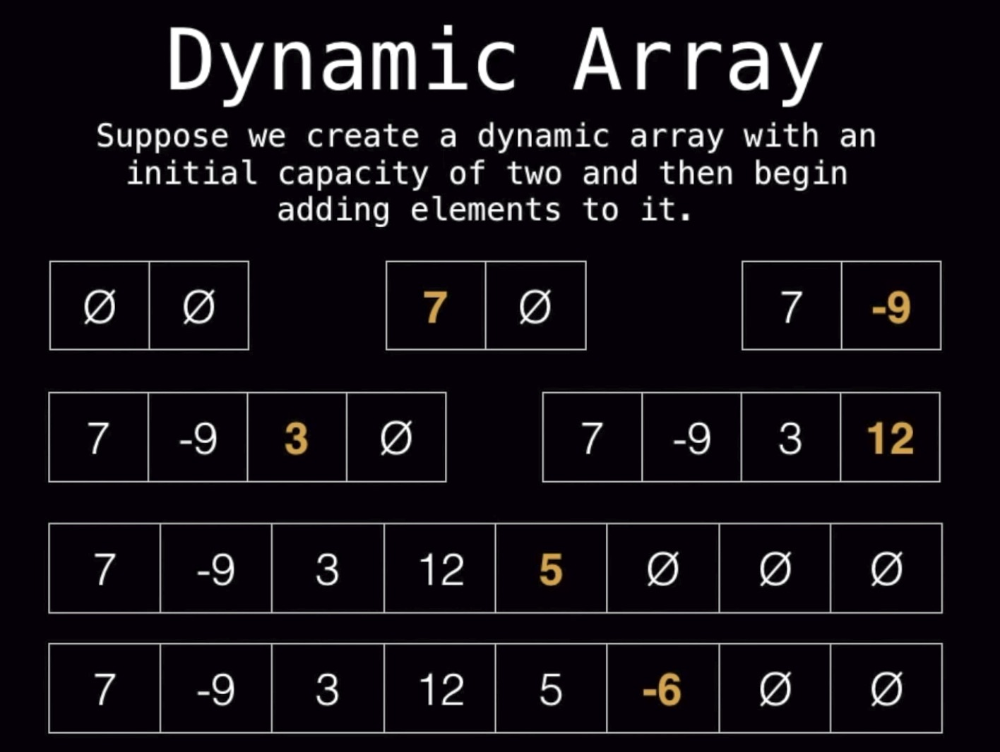

## Linked Lists

1. Used in many lists, queue and graph implementation.
1. Great to create circular lists.
1. Can easily model real world objects like train.
1. Used in separate chainging which is present in certain hashtable implementations to deal with hashing collisions.
1. Often used in implementation of adjacentcy lists of graph.
1. 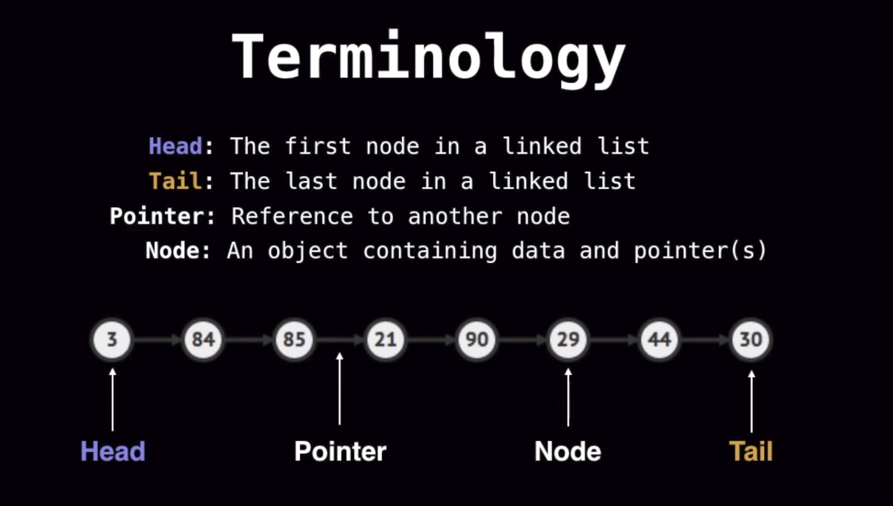
1. 
1. 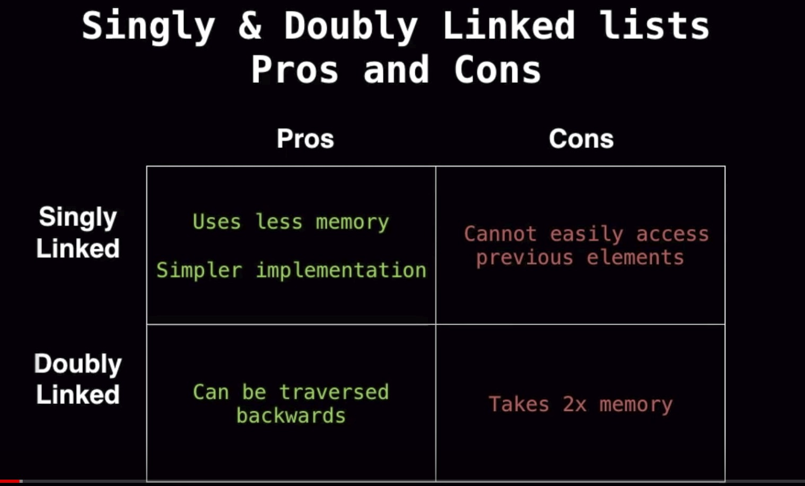
1. 64 bit machine -> points use 8 bytes
1. In Doubly linkedlist we can remove node in constant time
1. 
1. 
1. 
1. 
1. 
1. 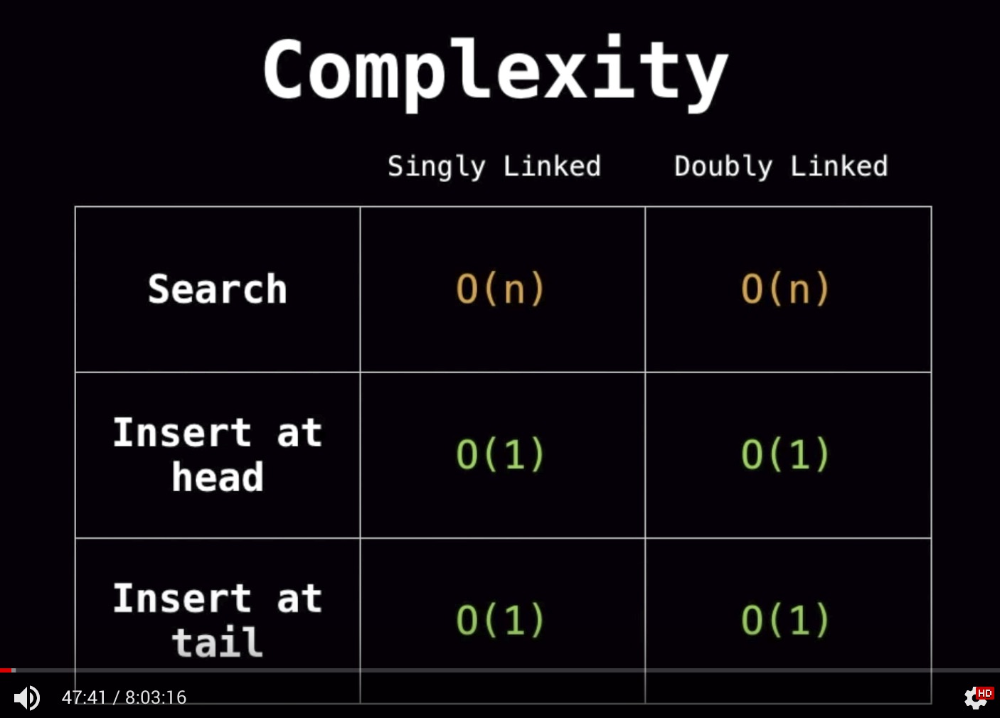

## Stack

1. A stack is a one-ended linear data structure which models a real world stack by having 2 primary operations - push and pop
1. Last In First Out (LIFO)
1. Comman usage areas,
    1. Undo mechanism
    1. Compiler syntax checking for matching brackets
    1. Used behind the scenes in recursion
    1. Used in DFS
1. 
1. 

## Queue

1. A queue is a linear data structure which models real world queue by having 2 primary operations - enqueue and dequeue
1. First In Last Out (FIFO)
1. Enqueue = Adding = Offering
1. Dequeue = Polling
1. Common usage areas,
    1. Real world queue
    1. Can be used to efficeintly keep track of the x most recently added elements.
    1. Web server management
    1. Used in BFS
1. 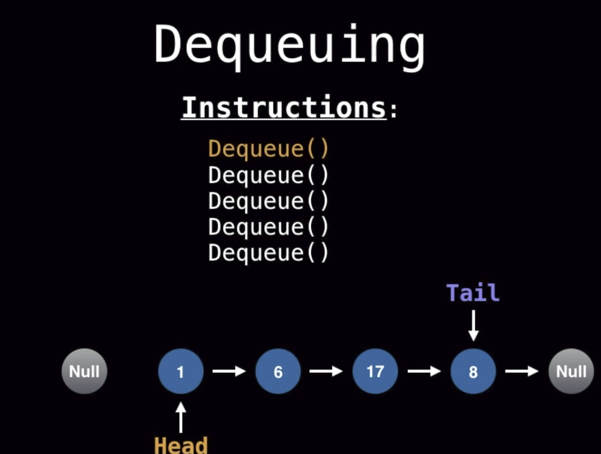
1. 

## heap

1. A heap is a tree based data strucuture that satisfies the heap varient.
1. Heap varient : If A is a parent node of B then A is ordered with respect to B for all nodes A,B in the heap.
1. 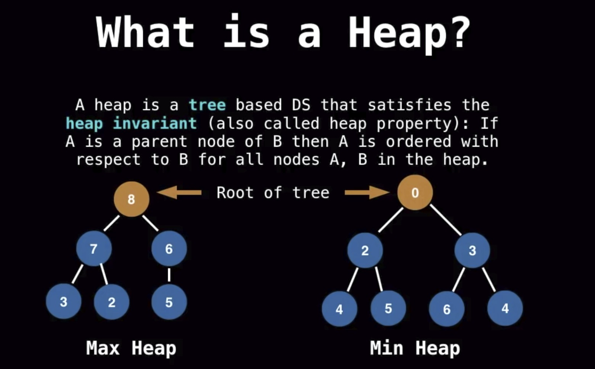
1. All Heaps must be trees
1. Some common types of heaps,
    1. Binary heap
    1. Fibonacci heap
    1. Binomial heap
    1. Pairing heap
1. Complete Binary tree
    1. A complete binary tree is a tree in which at every level, except possibly the last is completely filled and all the nodes are as far left as possible.
    1. 
    1. 2^(h+1) - 1 --> maximum number of nodes in a binary tree of height h
    1. floor(logn) --> height of binary tree given number of nodes n
    1. If the last level is half filled from left to right then it is called almost complete binary tree
    1. In a complete binary tree (n/2 + 1) to n all will be leaf nodes.
1. Binary heap
    1. A binary heap is a binary tree that supports the heap invarient.
    1. Binary heap can be implemented using arrays.
    1. 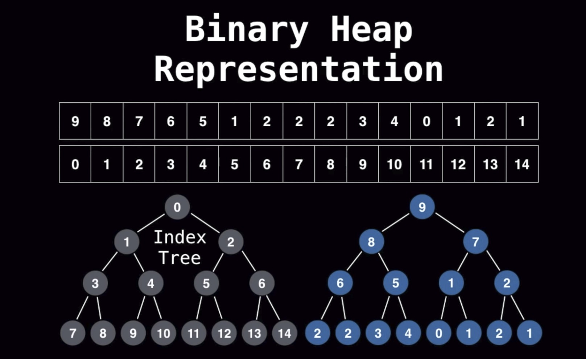
    1. If i is the parent node 2i+1 is it's left child and 2i+2 is it's right child (zero based)
    1. Adding an element
        1. Add to the left most and bottom most position of the complete binary tree and bubble or swim it to its right position
        1. Keep on swapping until the parent node and the inserted node does not satisfy the heap invareint
    1. Removing an element
        1. Swap the element to be removed with the last element in the complete binary tree (which happens to be the last element in the array)
        1. Check invariance and swim or bubble down by swapping with the lowest of the two child nodes
        1. In case of a tie select the left node
        1. Check the invarient to decide on whether to bubble up or bubble down
        1. Polling - O(longn) Removing - O(n)
1. Heapify
    1. Leaf nodes satisfy the heap invareint already so don't iterate through the leaf nodes.
    1. Start from the node with largest index which is not a leaf node and sink the node.

## Priority Queue

1. Priority queues are implemented using Heaps
1. Priority queues does not allow null values because they cannot be compared.
1. A priority queue is an Abstract Data Type (ADT) that operates similar to normal queue except that each element has a certain priority. The priority of the element in the priority queue determine the order in which elements are removed from the priority queue.
1. Priority queues only supports comparable data, meaning data inserted into the priority queue must be able to be ordered in some way either from least to greatest or gratest to least.
1. Common usages
    1. Certain implementations of Dijkstra's algo
    1. Anytime we need to dynamically fetch the "next best" or "next worst" element.
    1. Used in huffman coding (Lossless data compression)
    1. Best First Search such as A* use heaps to grab the next most promising node.
    1. Used in minimum spanning tree algo
1. 
1. 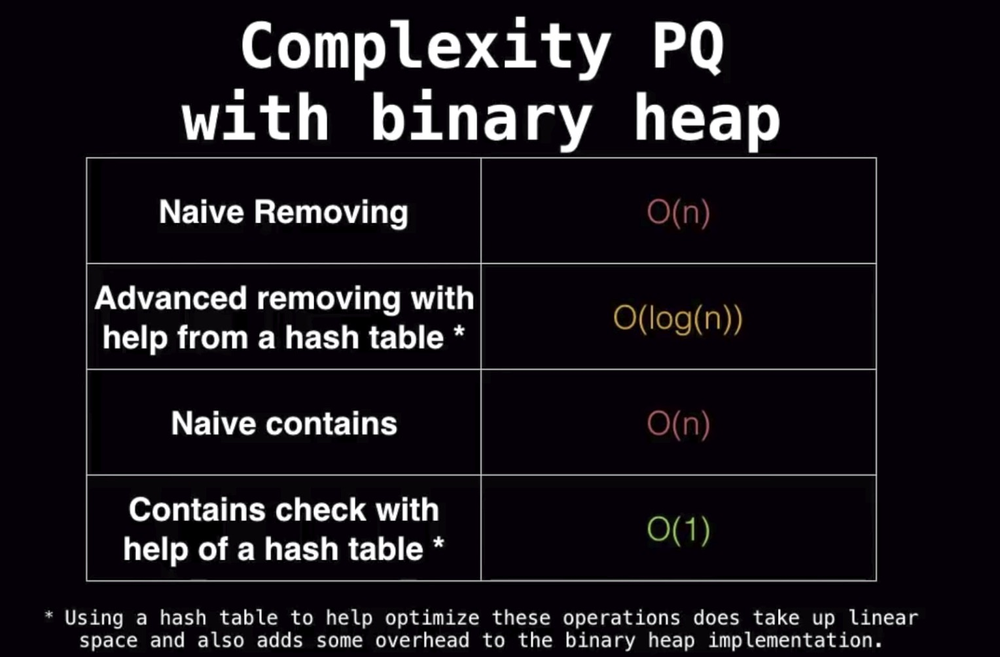
1. Turning Min PQ to Max PQ
    1. This can be done by negating the comparable interface
    1. Another method is to negate the number before insertion and negate again during polling

## Union Find

1. Union Find is a data structure that keeps track of elements which are split into one or more disjoint sets. It has 2 primary operations - Union and Find.
1. Find -> Given an element Union Find will tell what group the element belongs to
1. Union -> merges 2 groups together
1. Common Usage
    1. Kruskal's minimum spanning tree
        1. 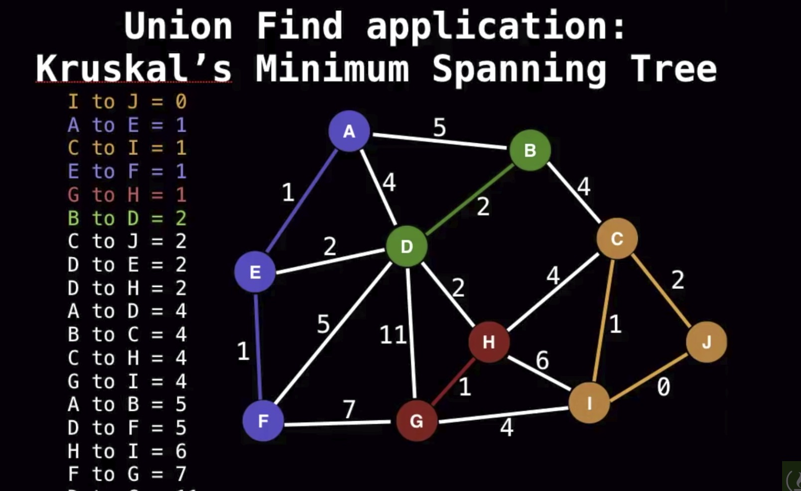
    1. Grid percolation
    1. Network connectivity
    1. Least common ancestor in trees
    1. Image processing
1. 
1. 
1. Creating Union Find
    1. To begin using Union Find, first construct a bijection (a mapping) between your objects and the integers in range [0,n), this step is not mandatory but it allows us to create an array based union find
    1. 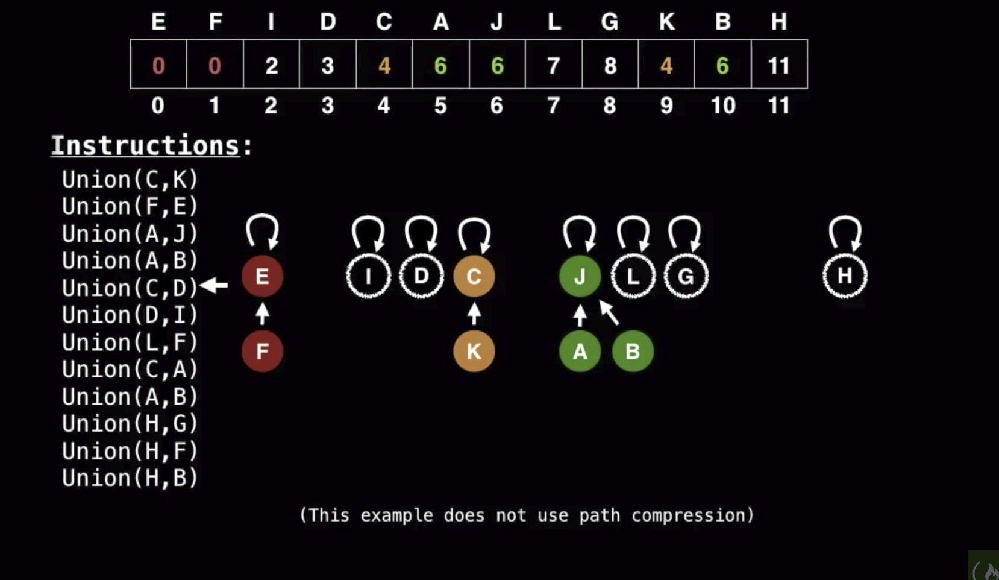
1. Find -> To find which component a particular element belongs to, find the root of that component by following the parent nodes until a self loop is reached
1. Unify -> To unify two elements, find which are the root nodes of each component and if the root nodes are from different component, make one root node to be the parent of other root node
1. Union Find does not have amortised time complexity without path compression
1. Path Compression
    1. When doing find operation point all the nodes in the path to the root once the root is found
    1. Since once all the nodes point to the root node directly find operation becomes constant time and thus it becomes amortised constant time.

## Tree

1. A tree is an undirected graph which satisfies any of the following definitions
    1. An acyclic connected graph
    1. A connected graph with N nodes and N-1 edges
    1. A graph in which any 2 vertices are connected exactly by one path
1. If we have a rooted tree then we will want to have a reference to the root node of the tree. Any node in a tree can be a root node.
1. A child node is a node extending from another node
1. The root node has no parent or the parent is itself(Ex: file directory)
1. 
1. A leaf node is a node with no children.
1. A subtree is a tree entirely contained within another. They are usually denoted by triangle
1. Binary Trees is a tree in which every node has at most 2 children

## Binary Search Trees

1. A binary search tree is binary tree that satisfies the BST invareint.
1. BST invareint : left subtree has smaller elements and right subtree has larger elements.
1. Common usage
    1. Implementation of some maps and set ADTs
    1. Red black tree
    1. AVL tree
    1. Splay tree
    1. Implementation of binay heap
    1. Syntax tree
    1. Treap - A probabilistic DS (uses a randomised BST)
1. 
1. Adding elements
    1. BST elements must be comparable
    1. Cases
        1. '< case' -> Recurse down left subtree
        1. '> case' -> Recurse down right subtree
        1. '= case' -> Handle finding a duplicate value
        1. 'null leaf' -> create a new node
    1. 
    1. 
1. Removing elements
    1. Find the element we want to remove
        1. If we hit a null node the element is not present
        1. comparator value `=` 0 -> found the node
        1. comparator value `<` 0 -> the value if it exists is in left subtree
        1. comparator value `>` 0 -> the value if it exists is in the right subtree
    1. Replace the node we want to remove with its successor (if any) to maintin BST invariant.
        1. Node to remove is a leaf node
            1. We can remove it directly without any side effects
        1. Node to remove has a right subtree
            1. The successor is the root node of the right subtree
        1. Node to remove has a left subtree
            1. The successor is the root node of the left subtree
        1. Node to remove has a left subtree and right subtree
            1. The successor can be the largest value in the left subtree or the smallest value in the right subtree
                1. Smallest value in the right subtree
                    1. Go right one node from the node to be removed and go left as far as possible
                    1. Copy the value to the node to be removed
                    1. Remove the node with any of the top 3 cases
                    1. 
                    1. 
                1. Largest value in the left subtree
                    1. Go left one node from the node to be removed and go as far right as possible
                    1. Copy the value to the node to be removed
                    1. Remove the node with any of the top 3 cases
1. Tree traversal
    1. Various tree traversal are preorder, inorder, postorder and level order
    1. 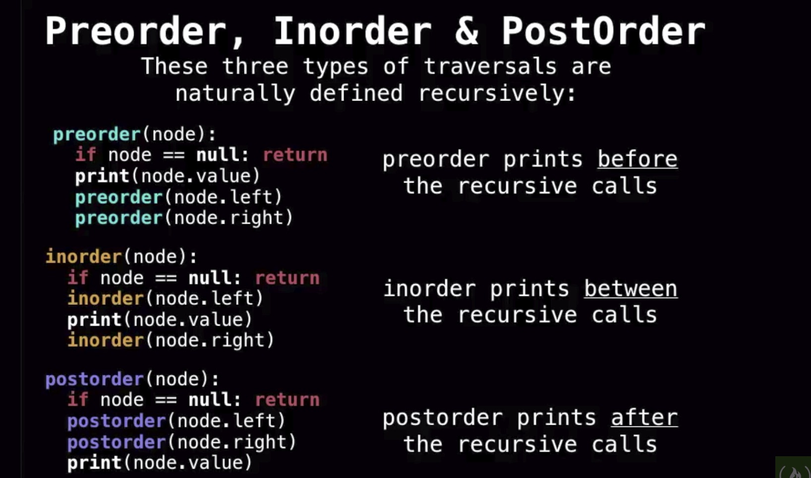
    1. Inorder traversal prints the values in increasing order
    1. Level order traversal
        1. Print nodes one layer at a time
        1. It is done using BFS (Breadth First Search)

## Hash Table

1. Hash Table
    1. A hash table is a data structure that provides a mapping from keys to values using a technique called hashing
    1. Keys must be unique but values can be duplicate
    1. Keys must be hashable
    1. Common Usage
        1. Item frequency calculation
        1. File comparison are done with checksums hash function
    1. Hash function
        1. A hash function H(x) is a function that maps a key 'x' to a whole number in a fixed range
        1. If H(x) == H(y) then objects x and y might be equal, but if H(x) != H(y) they are definitely not equal
        1. Hash Function must be deterministic. If H(x) = y, then H(x) should also produce y
        1. We try to make hash functions uniform, to reduce the number of collisions
    1. Keys in hash table must be immutable
    1. 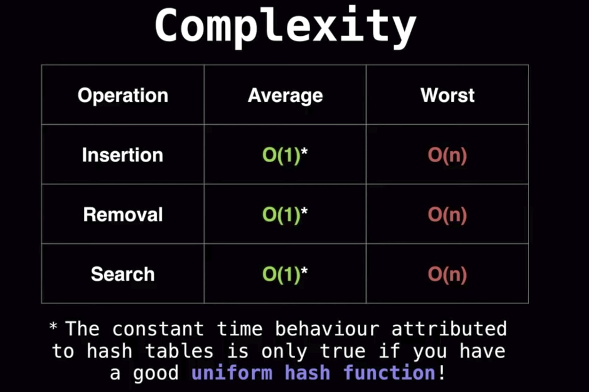
    1. Hash Collisions
        1. Hash collision occurs when 2 values get result in same index after hash computation
        1. Most popular hash collision resolutions are,
            1. Seprate chaining
                1. It deals with collisions by maintaining a data structure(usually a list) to hold all different values which hashed to a particular value
                1. The data structure does not have to be a list it can be anything like BST, AVL trees etc
                1. The data structure is usually called a bucket
                1. 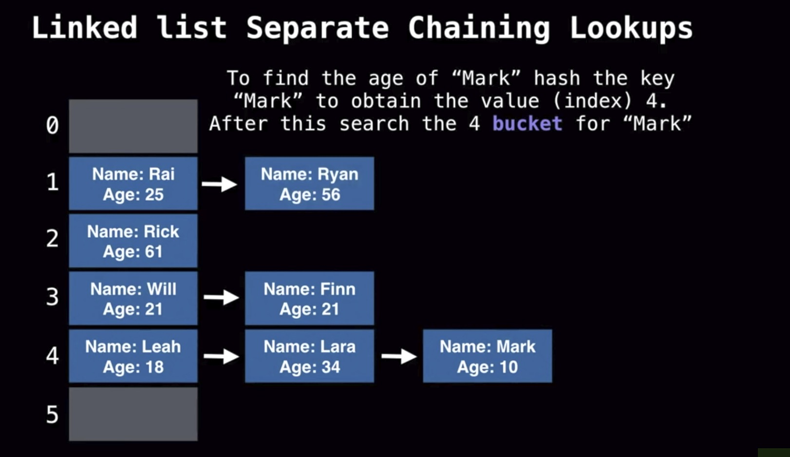
                1. FAQs
                    1. How do I maintain O(1) insertion and lookup time complexity once my HT gets really full and we have big buckets?
                        1. Once the HT contains a lot of elements you should create a new HT table with larger capacity and rehash all the items inside the old HT and disperse them throughout the new HT at different locations
                    1. How to remove a key-value pair from the HT?
                        1. Follow the same as for find and instead of returning the value, delete the element from the bucket or free memory
                    1. Can I use another datastrucuture to model the bucket behaviour?
                        1. Yes, common data structures are arrays, binary trees, self balancing trees or hybrid (Java hashmap)
                        1. Java switches to self balancing binary tree once the lenght gets biggger
            1. Open Addressing
                1. In open addressing all the items are stored in the same table and there is no auxillary data structure involved.
                1. This means we need to care a great deal about the size of the hash table and how many elements are currently in the table
                1. Load Factor = (No. of items) / (size of the table)
                1. 
                1. We need to keep the load factor below a threshold and grow the table when the threshold is met
                1. Probing
                    1. We obtain the hash of the key and when there is another entry with the same hash, we try another position in the hash table by offsetting the current position subject to a **Probing Sequence**.
                    1. We keep on probing unless a spot is found
                    1. 
                    1. Types of probing
                        1. Linear Probing
                            1. P(x) = ax + b, where a and b are constants
                        1. Quadratic Probing
                            1. P(x) = ax^2 + bx + c, where a and b are constants
                        1. Double Hashing
                            1. P(k,x) = x*H(k), where H(k) is a secondary hash function
                        1. Pseudo Random Number Generator
                            1. P(k,x) = x*RNG(H(k),x), where RNG is random number generator seeded with H(k)
                    1. Chaos with cycles
                        1. Most probing function that we use will end up in cycles
                        1. 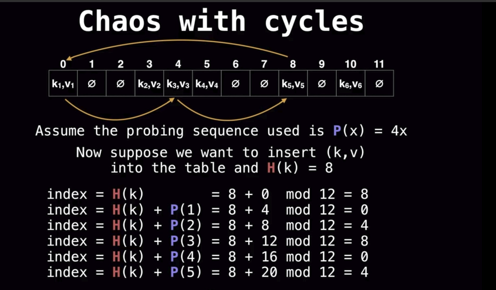
                        1. To avoid we must use probing functions that produce cycles at exactly lenght N
                    1. Linear Probing
                        1. P(x) = ax + b where a != 0 and b is constant and is obsolete
                        1. Not all linear probing functions are viable because of cycles
                        1. Chaos with cycles
                            1. If N is the table size, then if GCD(N, a) != 1 then it will produce a cycle
                            1. Values of N and a should be co prime to avoid cycles
                            1. So if we choose P(x) = 1x then our GCD will always be 1 no matter that the talbe size is
                            1. While resizing we must verify that the GCD value holds
                    1. Quadratic probing
                        1. P(x) = ax^2 + bx + c where a != 0
                        1. Most randomly selected quadratic functions will end up in a cycle
                        1. Chaos with cycles
                            1. P(x) = x^2 and talbe size should be a prime number > 3 and load factor <= 0.5
                            1. P(x) = (x^2 + x)/2 and talbe size should be powers of 2
                            1. P(x) = (-1^x)*x^2 and keep table size a prime number and N congruent to 3 mod 4
                    1. Double hashing
                        1. P(k, x) = x*h2(k), where h2 is the secondary hash function
                        1. Double hashing reduces to linear probing except the constant is unknown till runtime
                        1. Chaos with cycles
                            1. calcualte delta = h2(k) mod N where N is a prime number
                            1. If delta == 0 then set delta to be = 1
                            1. sincd N is prime then GCD(delta, N) is always 1 hence there will be no cycles
                1. Removing element
                    1. Removing elements from open addressing scheme naively will end up messing up the find operation.
                    1. Once an entry is delete we place a thombstone at that place
                    1. These thombstones will be removed while resizing or by a technique called "Lazy deleting"
                    1. In lazy deleting we keep the reference to the first thombstone we found in the find operation and swap the value that reference and replace old position with null
                    1. 

## Fenwick Tree (Binary Indexed Tree)

1. In a prefix array the updates will take more time, this is where fenwick tree comes into action.
1. A fenwick tree is a data structure that supports sum range queries as well as setting values in a static array and getting the value of the prefix sum up index efficiently.
1. 
1. We can't add or remove elements
1. Unlick regular arrays, in a fenwick tree a specific cell is responsible for other cells as well
1. The position of Least Significant Bit (LSB) determines the range of responsibility that cell has to the cells below.
1. 12 -> 01100, LSB is at 3rd position so 2^(3-1) = 2^2 = 4. This means this cell is resposible for 4 cells below it.
1. 
1. 
1. Fenwick Tree Construction
    1. Naive method would be to initialize the array to zero and do point updates for each addition to array it would give nlogn complexity
    1. Immediate parent can be calculated by i + LSB(i) (this is what we used for point updates)
    1. Iterate through all the elements in the array and just update the immediate parent.
    1. 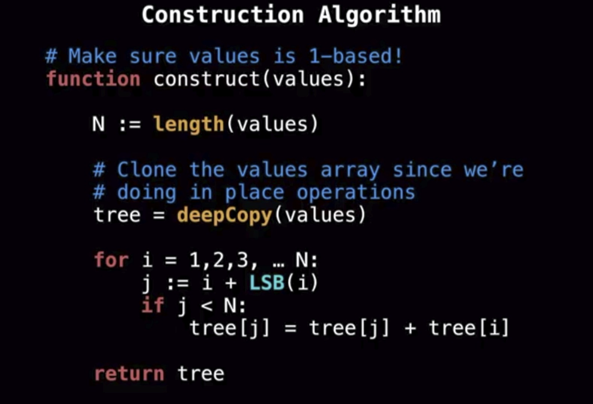
1. Range query and point updates
    1. Range Queries
        1. In a fenwick tree we may compute the prefix sum up to a certain index, which ultimately lets us perform range sum query
        1. To find the prefix sum of [1,i), start at i and cascade downward until we reach zero adding the values at each of the indices encountered
        1. 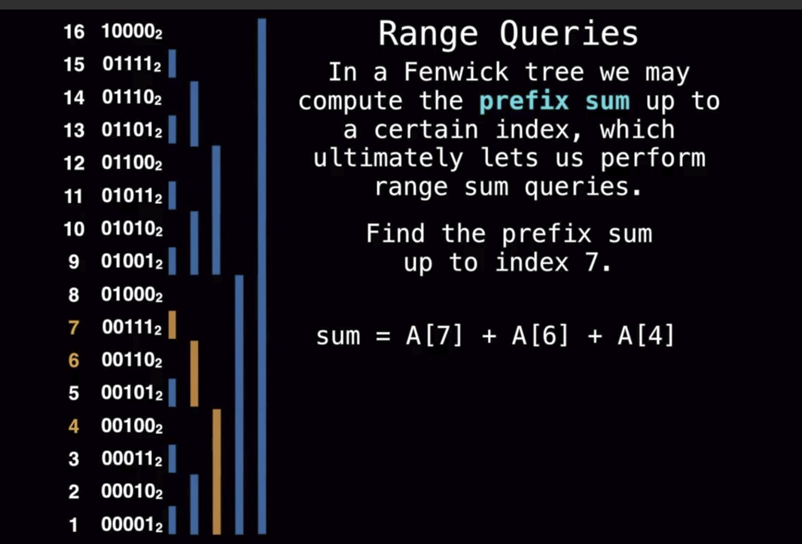
        1. 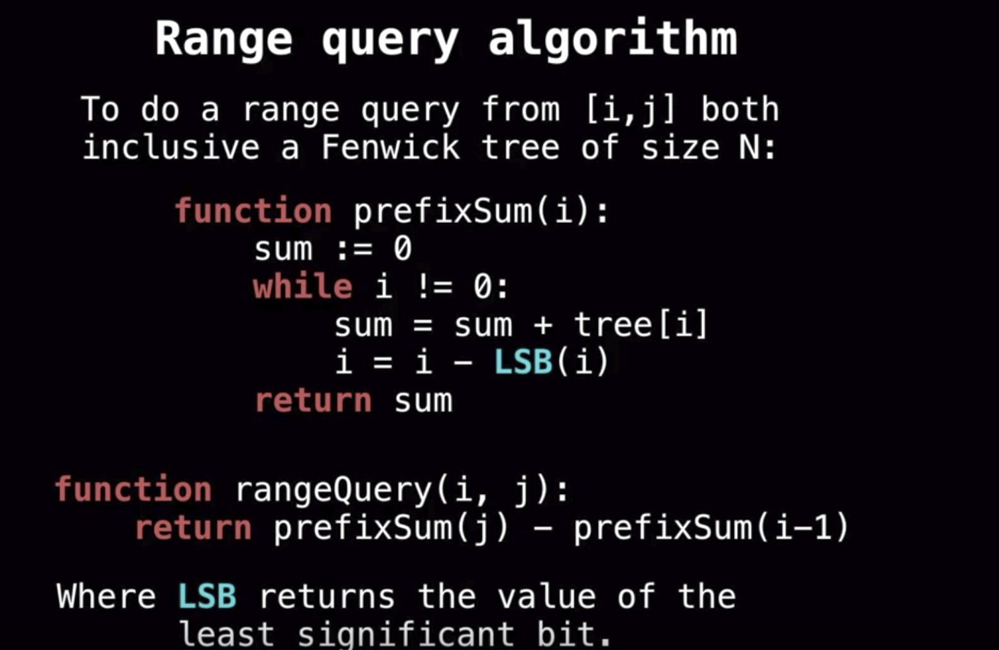
        1. Worst case for range queries is when most of the bits is 1 (We will have more LSB to find and sum). At that case the complexity is longbase2(n). In average case its faster.
    1. Point Updates
        1. Point update are the opposite of range queries, we will have to add the LSB to propagate the values up to the cells responsible for the update
        1. 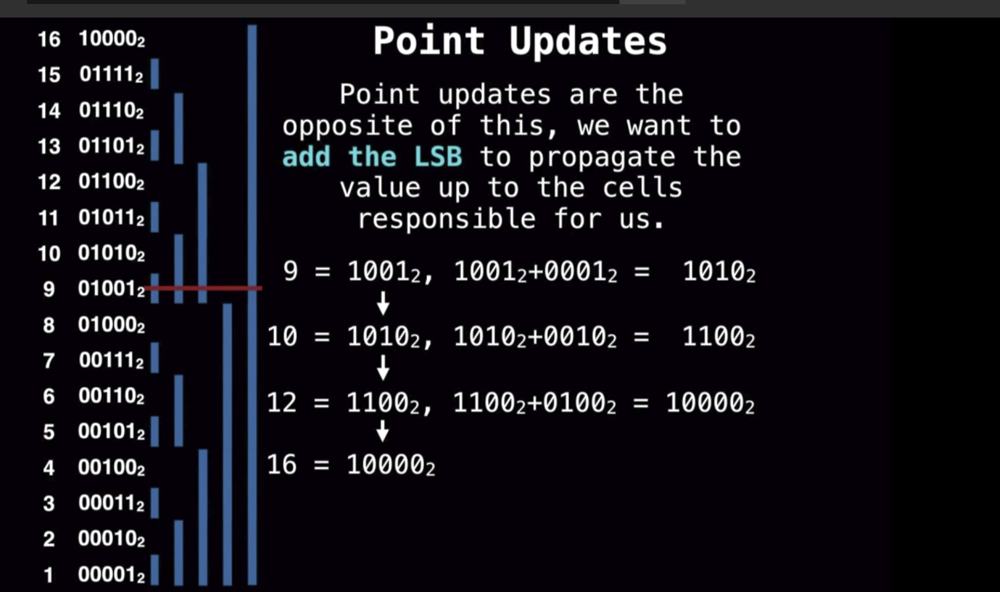
        1. 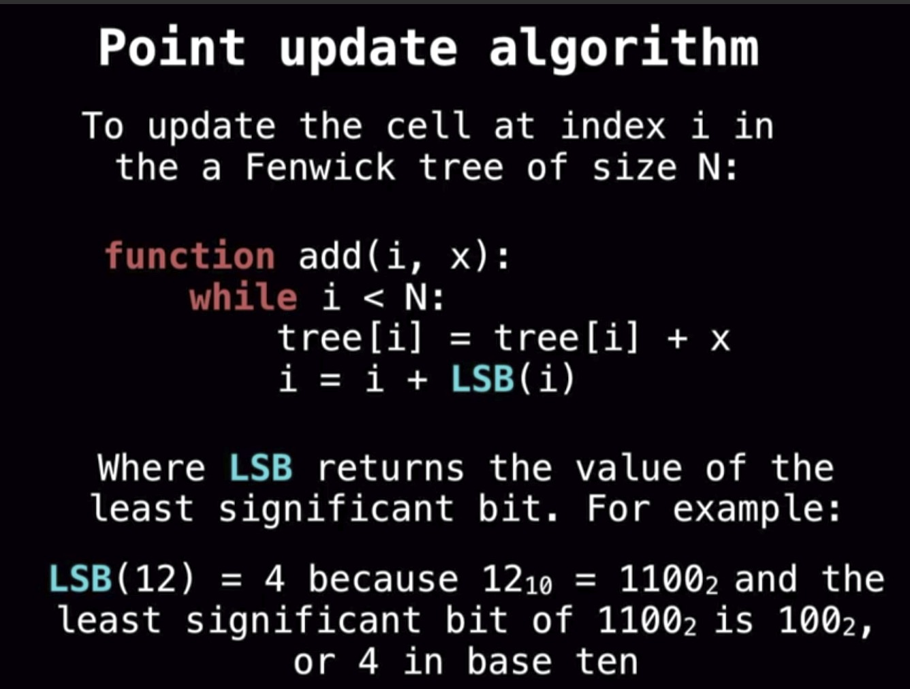
1. Range updates and point query
    1. Range update
        1. In this type of fenwick tree we can update a range of numbers with just 2 adds
        1. To update a value from 'left' to 'right' we must add(left, val) and add(right + 1, -val) - Explanation for this is when we add(left, val) we are adding essentially from l to n-1 so we have to subtract r+1 to n-1
        1. This makes updates logn
        1. This update is done on a new tree without disturbing the actual fenwick tree
    1. Point query
        1. Query can be done for one element
        1. To get the element at position i we must calculate prefixSum(i, currentTree) - prefixSum(i - 1, actualTree).
        1. aliter method -> sum all the elements till i (No need to maintain original tree). Space complexity reduced but O(n) time complexity

## Segment Trees

1. Segment trees are usually used to do range queries like max of range, sum of range etc
1. O(n) to build segment trees, O(n) space to maintain a segment tree and answers query in O(logn)
1. 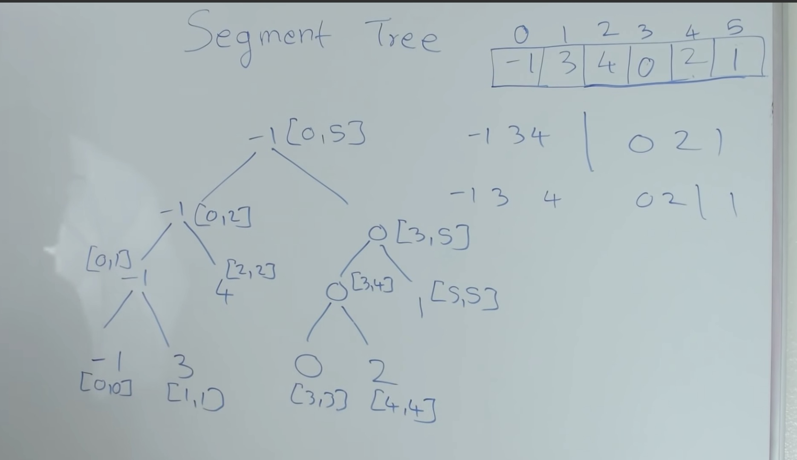
1. To find a query between a range, following 3 cases must be addressed
    1. Partial overlap -> Look in both directions
    1. Total overlap -> return the value at that node
    1. No overlap -> return a really big number in case of minimum, 0 in case of sum etc
1. 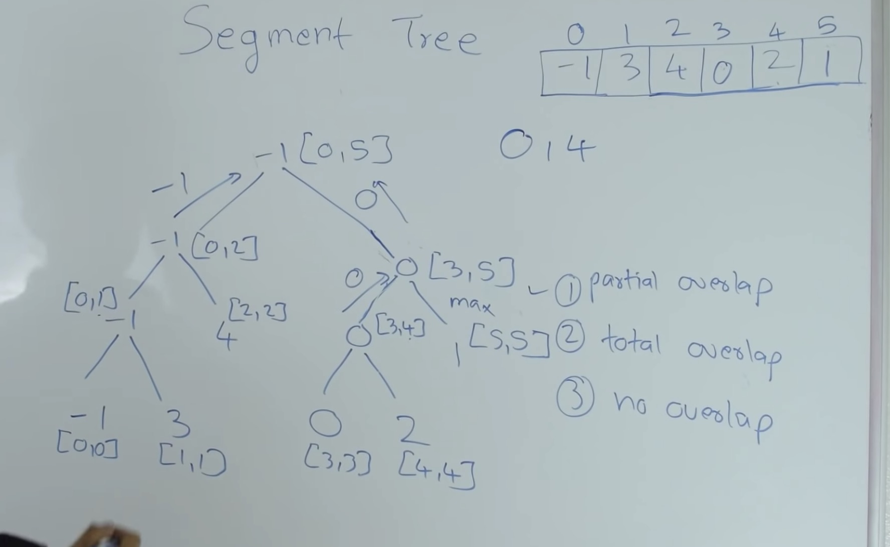
1. Segment trees can be implemented in arrays just like heaps
1. left child -> 2i+1, right child -> 2i-1 and parent -> (i-1)/2
1. Length of segment tree is ((next power of 2) x 2) -1
1. Total size at worst case is 4n space complexity -> O(n)
1. Time to create the array -> O(n)
1. To update a range of values
    1. partial overlap -> look in both directions
    1. total overlap -> reach to all the leaf nodes and update
    1. No overlap -> return
    1. if reached any leaf node update
1. Lazy propagation
    1. Lazy propagation is an optimization technique when there are a lot of updates
    1. We maintain another tree where we store the updates to be applied to the children
    1. The following are the cases,
        1. partial overlap -> look in both directions if non zero element is found in lazy prop array increment the current node and increment the children of the element in lazy prop by the same value
        1. total overlap -> increment the node with the value and return, increment the children of the node in lazy prop tree
        1. no overlap -> return
    1. Since the updates are not applied until we traverse down the array this is called lazy propagation
1. Array based efficient implementation
    1. In array based implementation of segment trees, recursions are avoided and iterative solution is used.
    1. A simple array of size 2*N which is not zero based and zero place is not really used
    1. To get the parent we just device

## Trie

1. Trie is a tree data structure used to store collections of strings
1. If 2 strings have common prefix they will have same ancestor in trie
1. This can be used to store thousands of string and we can easily search if a string exists in the collection or not
1. It can also be used to do prefix based search and sort it lexicographically
1. Insertion into a trie
    1. Every trie node as a ```Map<Character, TrieNode>``` and a boolean to represent end of word
    1. If the input is just alphabets or upper case or lower cases then we can replace the hashmap with an array
    1. Initially there is an root node with empty map
    1. If the character is not present in the map put the element in the map and point it to a new empty trie node
    1. If the character is present in the map get the next trie element and check the next character to insert
    1. If the character is the last character then mark the last character with an end of word trie node
    1. 