# Data Structures

1. A data structure is a way of organizing data so that it can be used effectively.
1. Abstract Data Types VS Data Structures
    1. An Abstract data type is an abstraction of a data structure which provides only the interface to which the data structure must adhere to.
    1. It Does not indicate specific details about how something should be implemented or in what programming language.
    1. 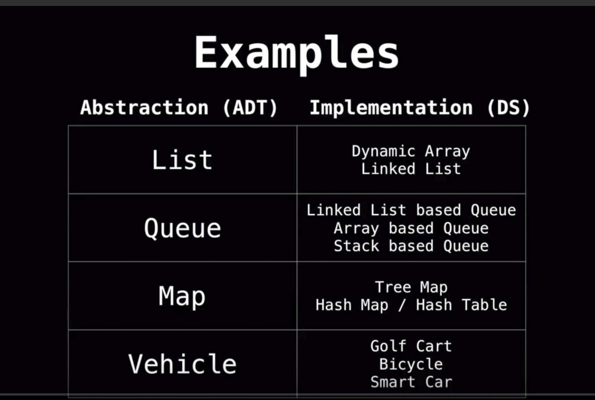
1. Computation Complexity
    1. How much time and space is needed?
    1. Big O
        1. Only cares about worst case.
        1. 
        1. Can ignore constants because n-> infinity(In real world this constant might matter)
        1. 
        1. 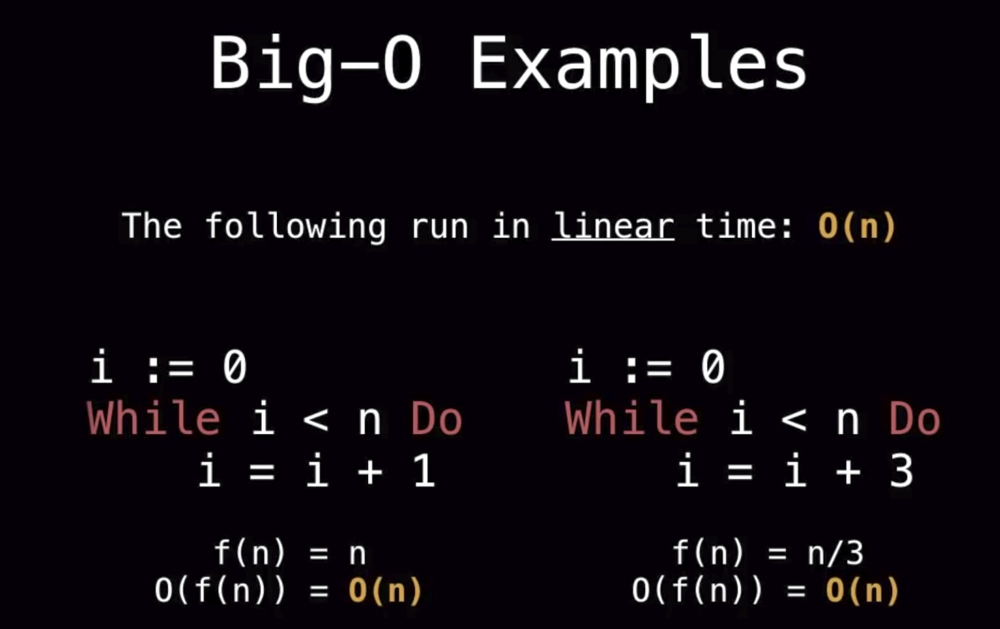
        1. 
        1. n + (n-1) + (n-2) ... = n(n+1)/2
        1. 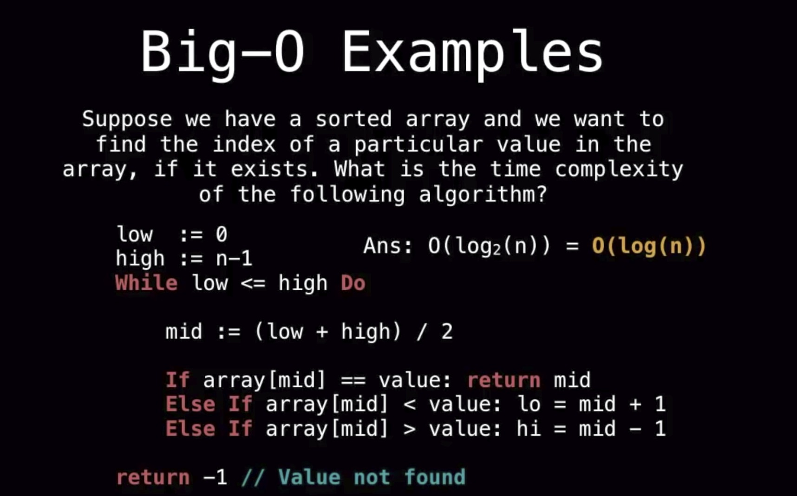
        1. Multiply the loops on different levels and add the loops on the same level
        1. Examples
            1. Finding all subsets of a set -> O(2^n)
            1. Finding all permutations of a String -> O(n!)
            1. Merge Sort -> O(nlogn)
            1. Iterating a matrix -> O(nm)
1. Arrays
    1. Static Arrays
        1. A static array is a fixed length container containing n elements indexable from the range [0,n-1]
        1. Each slot/index in the array can be referenced with a number
        1. Contigous chunks of memory
        1. When and where is static array used?
            1. Storing and accessing sequential data
            1. Temp storing objects
            1. Used as buffers for IO
            1. Lookup tables and inverse lookup tables
            1. To return multiple values from a function
            1. Used in DP to cache answers for sub problems
        1. 
    1. Dynamic Arrays
        1. Dynamic arrays can grow and shrink and can have methods like add and remove
        1. 
1. Linked Lists
    1. Used in many lists, queue and graph implementation.
    1. Great to create circular lists.
    1. Can easily model real world objects like train.
    1. Used in separate chainging which is present in certain hashtable implementations to deal with hashing collisions.
    1. Often used in implementation of adjacentcy lists of graph.
    1. 
    1. 
    1. 
    1. 64 bit machine -> points use 8 bytes
    1. In Doubly linkedlist we can remove node in constant time
    1. 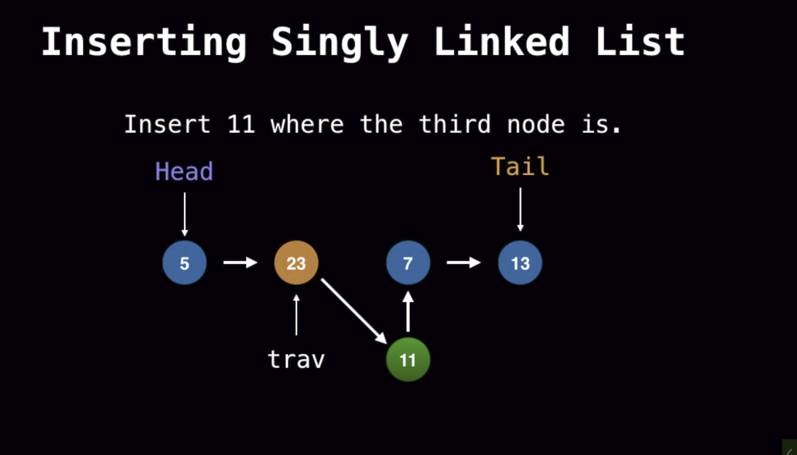
    1. 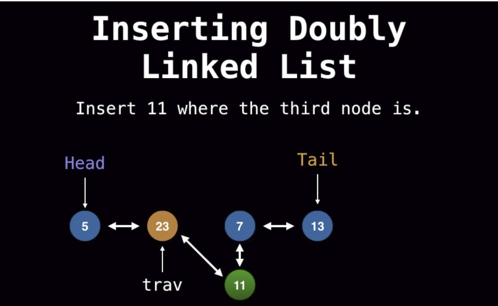
    1. 
    1. 
    1. 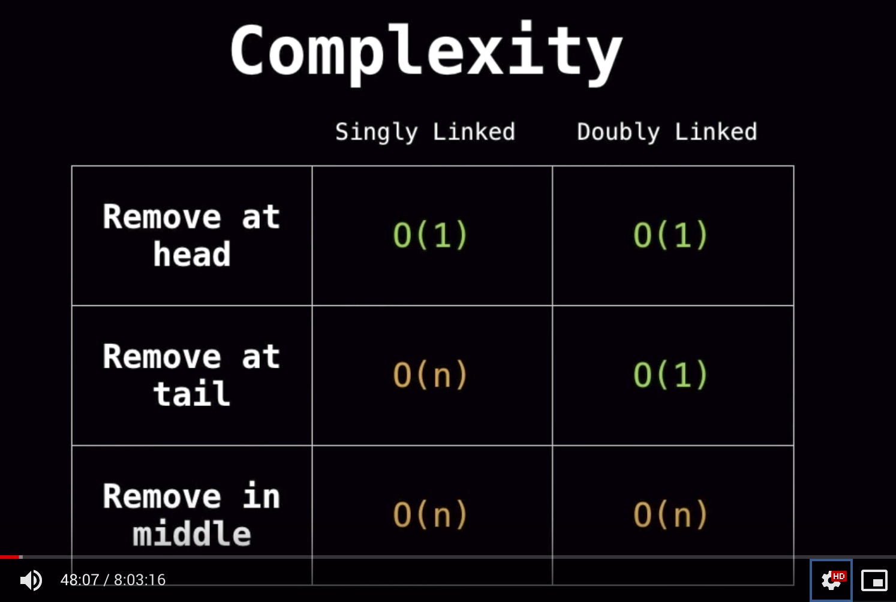
    1. 
1. Stack
    1. A stack is a one-ended linear data structure which models a real world stack by having 2 primary operations - push and pop
    1. Last In First Out (LIFO)
    1. Comman usage areas,
        1. Undo mechanism
        1. Compiler syntax checking for matching brackets
        1. Used behind the scenes in recursion
        1. Used in DFS
    1. 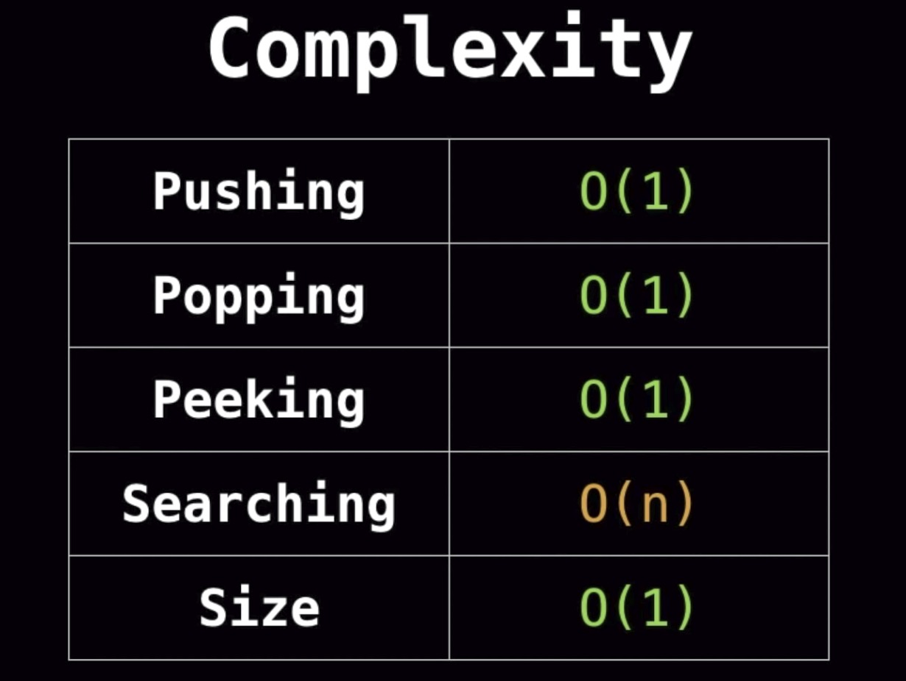
    1. 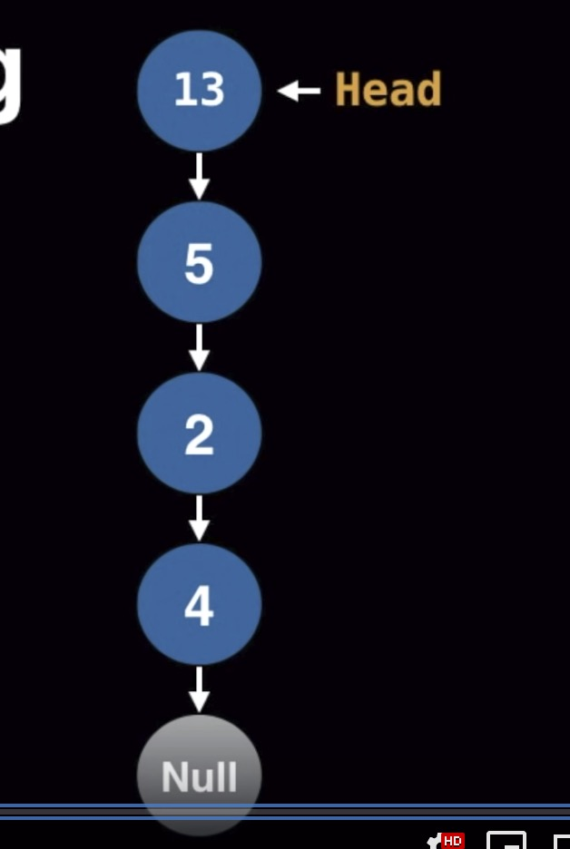
1. Queue
    1. A queue is a linear data structure which models real world queue by having 2 primary operations - enqueue and dequeue
    1. First In Last Out (FIFO)
    1. Enqueue = Adding = Offering
    1. Dequeue = Polling
    1. Common usage areas,
        1. Real world queue
        1. Can be used to efficeintly keep track of the x most recently added elements.
        1. Web server management
        1. Used in BFS
    1. 
    1. 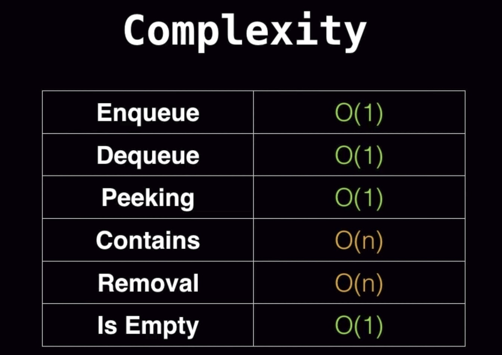
1. Heap
    1. A heap is a tree based data strucuture that satisfies the heap varient.
    1. Heap varient : If A is a parent node of B then A is ordered with respect to B for all nodes A,B in the heap.
    1. 
    1. All Heaps must be trees
    1. Some common types of heaps,
        1. Binary heap
        1. Fibonacci heap
        1. Binomial heap
        1. Pairing heap
    1. Complete Binary tree
        1. A complete binary tree is a tree in which at every level, except possibly the last is completely filled and all the nodes are as far left as possible.
        1. 
        1. 2^(h+1) - 1 --> maximum number of nodes in a binary tree of height h
        1. floor(logn) --> height of binary tree given number of nodes n
        1. If the last level is half filled from left to right then it is called almost complete binary tree
        1. In a complete binary tree (n/2 + 1) to n all will be leaf nodes.
    1. Binary heap
        1. A binary heap is a binary tree that supports the heap invarient.
        1. Binary heap can be implemented using arrays.
        1. 
        1. If i is the parent node 2i+1 is it's left child and 2i+2 is it's right child (zero based)
        1. Adding an element
            1. Add to the left most and bottom most position of the complete binary tree and bubble or swim it to its right position
            1. Keep on swapping until the parent node and the inserted node does not satisfy the heap invareint
        1. Removing an element
            1. Swap the element to be removed with the last element in the complete binary tree (which happens to be the last element in the array)
            1. Check invariance and swim or bubble down by swapping with the lowest of the two child nodes
            1. In case of a tie select the left node
            1. Check the invarient to decide on whether to bubble up or bubble down
            1. Polling - O(longn) Removing - O(n)
    1. Heapify
        1. Leaf nodes satisfy the heap invareint already so don't iterate through the leaf nodes.
        1. Start from the node with largest index which is not a leaf node and sink the node.
1. Priority Queue
    1. Priority queues are implemented using Heaps
    1. Priority queues does not allow null values because they cannot be compared.
    1. A priority queue is an Abstract Data Type (ADT) that operates similar to normal queue except that each element has a certain priority. The priority of the element in the priority queue determine the order in which elements are removed from the priority queue.
    1. Priority queues only supports comparable data, meaning data inserted into the priority queue must be able to be ordered in some way either from least to greatest or gratest to least.
    1. Common usages
        1. Certain implementations of Dijkstra's algo
        1. Anytime we need to dynamically fetch the "next best" or "next worst" element.
        1. Used in huffman coding (Lossless data compression)
        1. Best First Search such as A* use heaps to grab the next most promising node.
        1. Used in minimum spanning tree algo
    1. 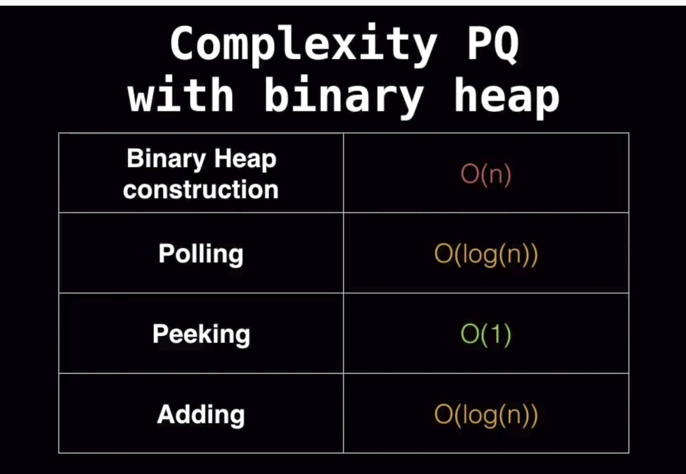
    1. 
    1. Turning Min PQ to Max PQ
        1. This can be done by negating the comparable interface
        1. Another method is to negate the number before insertion and negate again during polling
1. Union Find
    1. Union Find is a data structure that keeps track of elements which are split into one or more disjoint sets. It has 2 primary operations - Union and Find.
    1. Find -> Given an element Union Find will tell what group the element belongs to
    1. Union -> merges 2 groups together
    1. Common Usage
        1. Kruskal's minimum spanning tree
            1. 
        1. Grid percolation
        1. Network connectivity
        1. Least common ancestor in trees
        1. Image processing
    1. 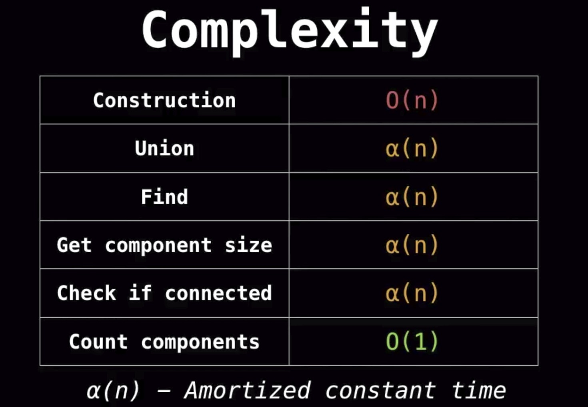
    1. 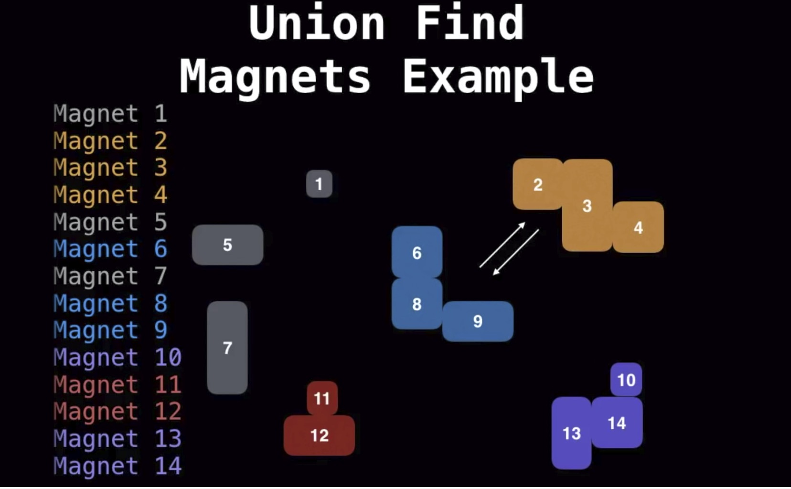
    1. Creating Union Find
        1. To begin using Union Find, first construct a bijection (a mapping) between your objects and the integers in range [0,n), this step is not mandatory but it allows us to create an array based union find
        1. 
    1. Find -> To find which component a particular element belongs to, find the root of that component by following the parent nodes until a self loop is reached
    1. Unify -> To unify two elements, find which are the root nodes of each component and if the root nodes are from different component, make one root node to be the parent of other root node
    1. Union Find does not have amortised time complexity without path compression
    1. Path Compression
        1. When doing find operation point all the nodes in the path to the root once the root is found
        1. Since once all the nodes point to the root node directly find operation becomes constant time and thus it becomes amortised constant time.
1. Tree
    1. A tree is an undirected graph which satisfies any of the following definitions
        1. An acyclic connected graph
        1. A connected graph with N nodes and N-1 edges
        1. A graph in which any 2 vertices are connected exactly by one path
    1. If we have a rooted tree then we will want to have a reference to the root node of the tree. Any node in a tree can be a root node.
    1. A child node is a node extending from another node
    1. The root node has no parent or the parent is itself(Ex: file directory)
    1. 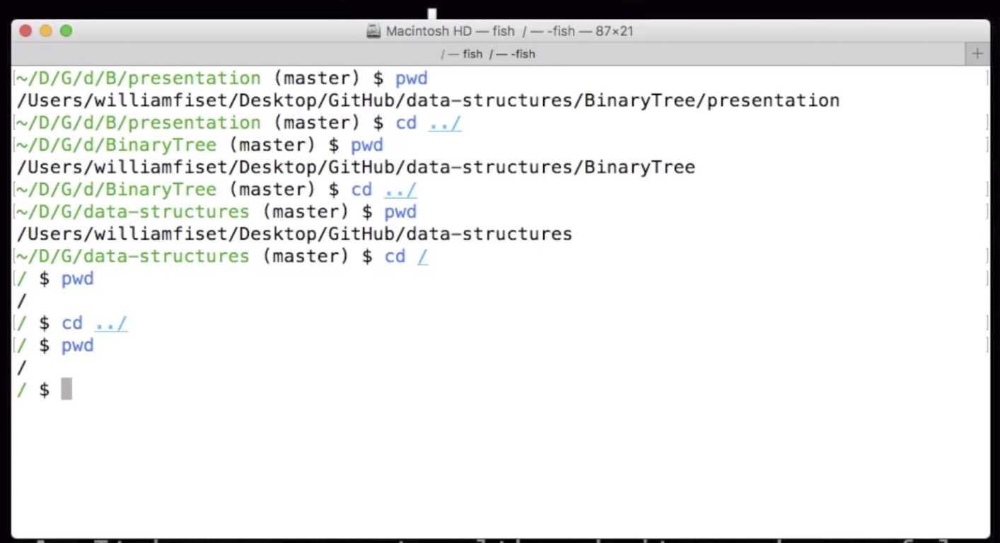
    1. A leaf node is a node with no children.
    1. A subtree is a tree entirely contained within another. They are usually denoted by triangle
1. Binary Trees
    1. A tree in which every node has at most 2 children
1. Binary Search Trees
    1. A binary search tree is binary tree that satisfies the BST invareint.
    1. BST invareint : left subtree has smaller elements and right subtree has larger elements.
    1. Common usage
        1. Implementation of some maps and set ADTs
        1. Red black tree
        1. AVL tree
        1. Splay tree
        1. Implementation of binay heap
        1. Syntax tree
        1. Treap - A probabilistic DS (uses a randomised BST)
    1. 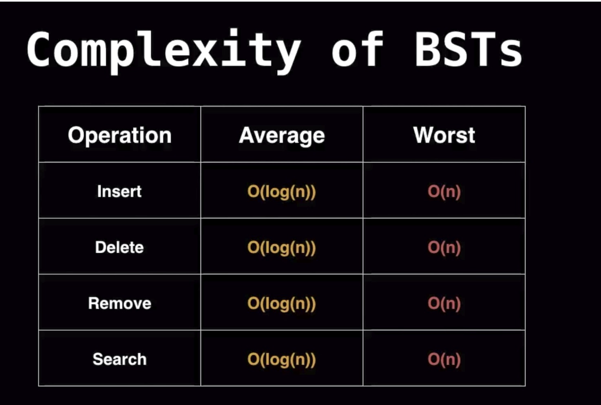
    1. Adding elements
        1. BST elements must be comparable
        1. Cases
            1. '< case' -> Recurse down left subtree
            1. '> case' -> Recurse down right subtree
            1. '= case' -> Handle finding a duplicate value
            1. 'null leaf' -> create a new node
        1. 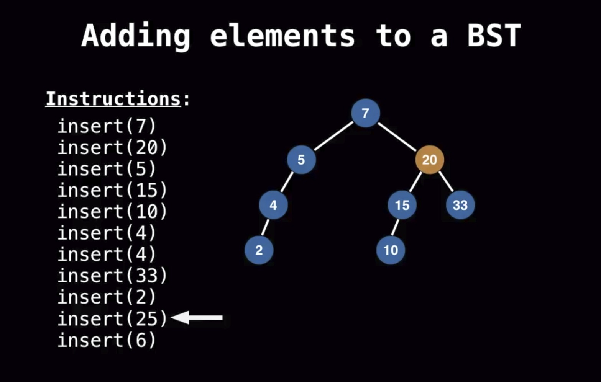
        1. 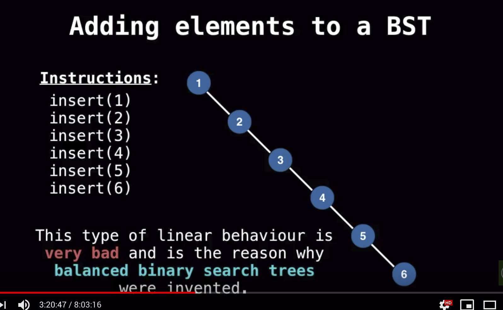
    1. Removing elements
        1. Find the element we want to remove
            1. If we hit a null node the element is not present
            1. comparator value `=` 0 -> found the node
            1. comparator value `<` 0 -> the value if it exists is in left subtree
            1. comparator value `>` 0 -> the value if it exists is in the right subtree 
        1. Replace the node we want to remove with its successor (if any) to maintin BST invariant.
            1. Node to remove is a leaf node
                1. We can remove it directly without any side effects
            1. Node to remove has a right subtree
                1. The successor is the root node of the right subtree
            1. Node to remove has a left subtree
                1. The successor is the root node of the left subtree
            1. Node to remove has a left subtree and right subtree
                1. The successor can be the largest value in the left subtree or the smallest value in the right subtree
                    1. Smallest value in the right subtree
                        1. Go right one node from the node to be removed and go left as far as possible
                        1. Copy the value to the node to be removed
                        1. Remove the node with any of the top 3 cases
                        1. 
                        1. 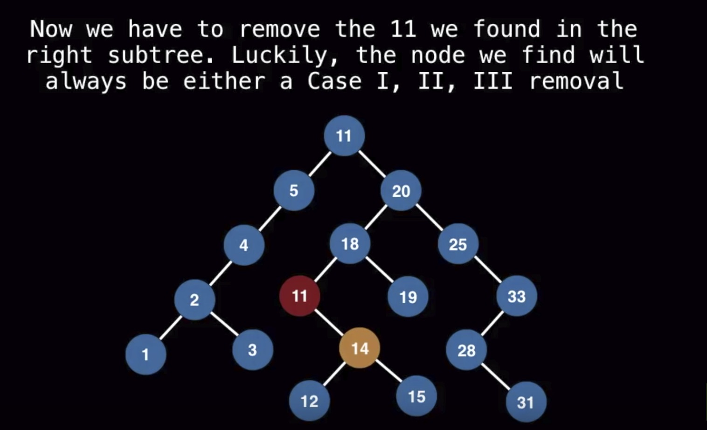
                    1. Largest value in the left subtree
                        1. Go left one node from the node to be removed and go as far right as possible
                        1. Copy the value to the node to be removed
                        1. Remove the node with any of the top 3 cases
    1. Tree traversal
        1. Various tree traversal are preorder, inorder, postorder and level order
        1. 
        1. Inorder traversal prints the values in increasing order
        1. Level order traversal
            1. Print nodes one layer at a time
            1. It is done using BFS (Breadth First Search)