# Module 1

## Overview

Go step by step through the different components and concepts involved in architecting a web application.

## Module Objectives

1. Understand the concepts, components, and technology trade-offs involved in architecting a web application.
2. Learn various architectural styles such as the client-server, peer to peer decentralized architecture, the fundamentals of data flow in a web application, concepts like scalability, high availability and much more.
3. Master the techniques of picking the right architecture and the technology stack to implement a use case.

## Different Tiers in Software Architecture

1. Introduction
   1. Think of a tier as a logical separation of components in an application or a service.
   2. physical separation at the component level
   3. components
      1. Database
      2. Backend application server
      3. User interface
      4. Messaging
      5. Caching
2. Single Tier Applications
   1. A single-tier application is an application where the user interface, backend business logic & the database all reside in the same machine.
   2. Advantages
      1. no network latency
      2. data is easily & quickly available
      3. data of the user stays in his machine
   3. Disadvantages
      1. Business has no control over the application
      2. no code or features changes can possibly be done until the customer manually updates
      3. vulnerable to being tweaked & reversed engineered
3. Two Tier Application
   1. A Two-tier application involves a client and a server. The client would contain the user interface & the business logic in one machine. And the backend server would be the database running on a different machine. The database server is hosted by the business & has control over it.
   2. Need for 2 tier
      1. to-do list app or a similar planner or a productivity app
      2. fewer network calls
      3. online browser & app-based games
         1. get downloaded on the client just once
         2. network calls only to keep the game state persistent.
4. Three Tier Applications
   1. In a three-tier application, the user interface, application logic & the database all lie on different machines & thus have different tiers. They are physically separated.
5. N tier applications
   1. An N-tier application is an application which has more than three components involved.
   2. components
      1. Cache
      2. Message queues for asynchronous behaviour
      3. Load balancers
      4. Search servers for searching through massive amounts of data
      5. Components involved in processing massive amounts of data
      6. Components running heterogeneous tech commonly known as web services etc.
   3. There is another name for n-tier apps, the “distributed applications”
   4. Need for N-tier
      1. Two software design principles that are key to explaining this are the Single Responsibility Principle & the Separation of Concerns.
      2. Single Responsibility Principle
         1. Single Responsibility Principle simply means giving one, just one responsibility to a component & letting it execute it with perfection
         2. This approach gives us a lot of flexibility & makes management easier.
         3. Dedicated teams & code repositories for every component
         4. Single responsibility principle is a reason why I was never a fan of stored procedures.
         5. Stored procedures enable us to add business logic to the database
         6. A database should not hold business logic, it should only take care of persisting the data
      3. Separation Of Concerns
         1. Separation of concerns kind of means the same thing, be concerned about your work only & stop worrying about the rest of the stuff.
         2. Keeping the components separate makes them reusable.
         3. Different services can use the same database, the messaging server or any component as long as they are not tightly coupled with each other.
      4. Having loosely coupled components is the way to go. The approach makes scaling the service easy in future when things grow beyond a certain level.
   5. Difference Between Layers & Tiers
      1. The difference between layers and tiers is that the layers represent the organization of the code and breaking it into components.
      2. Tiers involve physical separation of components

## Web Architecture

1. What?
   1. Web architecture involves multiple components like database, message queue, cache, user interface & all running in conjunction with each other to form an online service.
2. Client Server Architecture
   1. Client-Server architecture is the fundamental building block of the web.
   2. The architecture works on a request-response model. The client sends the request to the server for information & the server responds with it.
   3. A very small percent of the business websites and applications use the peer to peer architecture, which is different from the client-server.
3. Client
   1. The client holds our user interface.
   2. The user interface is the presentation part of the application
4. Types of Client
   1. Thin Client
      1. Thin Client is the client which holds just the user interface of the application.
      2. It has no business logic of any sort. For every action, the client sends a request to the backend server.
   2. Thick Client
      1. On the contrary, the thick client holds all or some part of the business logic.
      2. These are the two-tier applications.
5. Server
   1. The primary task of a web server is to receive the requests from the client & provide the response after executing the business logic based on the request parameters received from the client.
   2. Kinds
      1. application servers
      2. Proxy server
      3. Mail server
      4. File server
      5. Virtual server
   3. Java, we would pick Apache Tomcat or Jetty
   4. hosting websites, we would pick the Apache HTTP Server.
   5. Server-Side Rendering
      1. Often the developers use a server to render the user interface on the backend & then send the rendered data to the client.
6. Communication Between the Client & the Server
   1. Request-Response Model
      1. The client & the server have a request-response model.
      2. If there is no request, there is no response. Pretty simple right?
   2. HTTP Protocol
      1. HTTP protocol is a request-response protocol that defines how information is transmitted across the web.
      2. It’s a stateless protocol, every process over HTTP is executed independently & has no knowledge of previous processes.
      3. More on http protocol [Here](https://developer.mozilla.org/en-US/docs/Web/HTTP/Overview)
   3. REST API & API Endpoints
      1. Speaking from the context of modern N-tier web applications, every client has to hit a REST end-point to fetch the data from the backend.
      2. The backend application code has a REST-API implemented which acts as an interface to the outside world requests.
7. REST API
   1. REST
      1. REST stands for Representational State Transfer.
      2. It’s a software architectural style for implementing web services
   2. REST API
      1. A REST API is an API implementation that adheres to the REST architectural constraints.
      2. A REST API takes advantage of the HTTP methodologies to establish communication between the client and the server.
      3. The communication between the client and the server is a stateless process.
      4. every time a client interacts with the backend, it has to send the authentication information to it as well.
      5. his entirely decouples the backend & the client code.
   3. Decoupling Clients & the Backend Service
      1. With the availability of the endpoints, the backend service does not have to worry about the client implementation
      2. Developers can have different implementations with separate codebases, for different clients, be it a mobile browser, a desktop browser, a tablet or an API testing tool.
      3. Introducing new types of clients or modifying the client code has no effect on the functionality of the backend service.
      4. This means the clients and the backend service are decoupled.
   4. Application Development Before the REST API
      1. We often tightly coupled the backend code with the client. JSP (Java Server Pages) is one example of it.
8. API Gateway
   1. 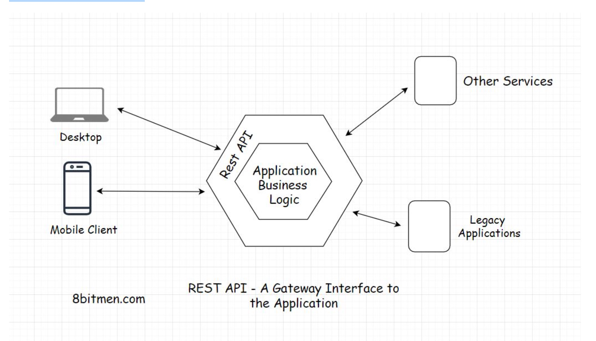
   2. The REST-API acts as a gateway, as a single entry point into the system.
   3. It encapsulates the business logic.
   4. taking care of the authorization, authentication, sanitizing the input data & other necessary tasks before providing access to the application resources.
9. modes of data transfer
   1. 
   2. HTTP PULL
      1. The client sends the request & the server responds with the data.
      2. This is the default mode
      3. The client pulls the data from the server whenever it requires. And it keeps doing it over and over to fetch the updated data.
      4. Every hit on the server costs the business money & adds more load on the server.
      5. What if there is no updated data available on the server, every time the client sends a request?
      6. The client doesn’t know that, so naturally, it would keep sending the requests to the server over and over.
   3. HTTP PUSH
      1. The client sends the request for particular information to the server, just for the first time, & after that the server keeps pushing the new updates to the client whenever they are available.
      2. This is also known as a Callback.
      3. Client phones the server for information. The server responds, Hey!! I don’t have the information right now but I’ll call you back whenever it is available.
      4. A very common example of this is user notifications.
      5. technologies
         1. Ajax Long polling
         2. Web Sockets
         3. HTML5 Event Source
         4. Message Queues
         5. Streaming over HTTP
10. HTTP Pull - Polling with Ajax
    1. AJAX
       1. Asynchronous JavaScript & XML
       2. The name says it all, it is used for adding asynchronous behaviour to the web page.
       3. AJAX uses an XMLHttpRequest object for sending the requests to the server which is built-in the browser
    2. This dynamic technique of requesting information from the server after regular intervals is known as Polling.
11. HTTP PUSH
    1. Time To Live (TTL)
       1. In the regular client-server communication, which is HTTP PULL, there is a Time to Live (TTL) for every request. It could be 30 secs to 60 secs, varies from browser to browser.
       2. If the client doesn’t receive a response from the server within the TTL, the browser kills the connection
       3. Open connections consume resources & there is a limit to the number of open connections a server can handle at one point in time.
       4. Hence, the TTL is used in client-server communication.
    2. Persistent Connection
       1. A persistent connection is a network connection between the client & the server that remains open for further requests & the responses, as opposed to being closed after a single communication.
    3. Heartbeat Interceptors
       1. The connection between the client and the server stays open with the help of Heartbeat Interceptors.
       2. These are just blank request responses between the client and the server to prevent the browser from killing the connection.
    4. Resource Intensive
       1. Persistent connections consume a lot of resources in comparison to the HTTP Pull behaviour.
    5. Technologies
       1. Web Sockets
          1. Is not supported in HTTP/2
          2. A Web Socket connection is ideally preferred when we need a persistent bi-directional low latency data flow from the client to server & back.
          3. Web Sockets tech doesn’t work over HTTP. It runs over TCP.
          4. The server & the client should both support web sockets or else it won’t work.
       2. AJAX – Long Polling
          1. Long Polling lies somewhere between Ajax & Web Sockets.
          2. In this technique instead of immediately returning the response, the server holds the response until it finds an update to be sent to the client
          3. The server doesn’t return an empty response.
          4. If the connection breaks, the client has to re-establish the connection to the server.
          5. Long polling can be used in simple asynchronous data fetch use cases when you do not want to poll the server every now & then.
       3. HTML5 Event Source API & Server Sent Events
          1. Instead of the client polling for data, the server automatically pushes the data to the client whenever the updates are available
          2. The incoming messages from the server are treated as Events.
          3. To implement server-sent events, the backend language should support the technology
          4. On the UI HTML5 Event source API is used to receive the data in-coming from the backend.
          5. The data flow is in one direction only, that is from the server to the client.
          6. SSE is ideal for scenarios such as a real-time feed like that of Twitter, displaying stock quotes on the UI, real-time notifications etc.
          7. Pros
             1. Light weight
             2. HTTP & HTTP/2 compatible
          8. Cons
             1. Proxy is tricky
             2. Stateful
       4. Streaming Over HTTP
          1. Streaming Over HTTP is ideal for cases where we need to stream large data over HTTP by breaking it into smaller chunks
          2. This is possible with HTML5 & a JavaScript Stream API.
          3. The technique is primarily used for streaming multimedia content, like large images, videos etc, over HTTP.
          4. To stream data, both the client & the server agree to conform to some streaming settings.
12. Summary
    1. Long polling has a connection open time slightly longer than the polling mechanism.
    2. Web Sockets have bi-directional data flow
    3. Server sent events facilitate data flow from the server to the client.
    4. Streaming over HTTP facilitates streaming of large objects like multi-media files.
13. Client-Side Vs Server-Side Rendering
    1. Client-Side Rendering
       1. Browser has to render the response on the window in the form of an HTML page.
       2. For this, the browser has several components, such as the:
          1. Browser engine
          2. Rendering engine
          3. JavaScript interpreter
          4. Networking & the UI backend
          5. Data storage etc.
       3. The rendering engine constructs the DOM tree, renders & paints the construction.
    2. Server-Side Rendering
       1. To avoid all this rendering time on the client, developers often render the UI on the server, generate HTML there & directly send the HTML page to the UI.
       2. It ensures faster rendering of the UI, averting the UI loading time in the browser window since the page is already created & the browser doesn’t have to do much assembling & rendering work.
    3. Use Cases For Server-Side & Client-Side Rendering
       1. The server-side rendering approach is perfect for delivering static content, such as WordPress blogs.
       2. It’s also good for SEO as the crawlers can easily read the generated content.
       3. A big downside to this is once the number of concurrent users on the website rises, it puts an unnecessary load on the server.
       4. Client-side rendering works best for modern dynamic Ajax-based websites.
       5. We can use server-side rendering for the home page & for the other static content on our website & use client-side rendering for the dynamic pages.

## Scalability

1. What?
   1. Scalability means the ability of the application to handle & withstand increased workload without sacrificing the latency.
   2. For instance, if your app takes x seconds to respond to a user request. It should take the same x seconds to respond to each of the million concurrent user requests on your app.
   3. 
   4. Latency
      1. Latency is the amount of time a system takes to respond to a user request
      2. No matter how much the traffic load on a system builds up, the latency should not go up. This is what scalability is.
   5. Measuring Latency
      1. Latency is measured as the time difference between the action that the user takes on the website, it can be an event like the click of a button, & the system response in reaction to that event.
      2. Divisons
         1. 
         2. Network Latency
            1. Network Latency is the amount of time that the network takes for sending a data packet from point A to point B.
            2. To cut down the network latency, businesses use CDN & try to deploy their servers across the globe as close to the end-user as possible.
         3. Application Latency
            1. Application Latency is the amount of time the application takes to process a user request.
2. Types
   1. Two types
      1. Vertical
      2. Horizontal
   2. Vertical Scaling
      1. Vertical scaling means adding more power to your server.
      2. Ideally, when the traffic starts to build upon your app the first step should be to scale vertically. Vertical scaling is also called scaling up.
      3. doesn’t require any code refactoring
      4. There is a limit to the capacity we can augment for a single server.
   3. Horizontal Scaling
      1. Horizontal scaling, also known as scaling out, means adding more hardware to the existing hardware resource pool.
      2. This increases the computational power of the system as a whole.
      3. there is literally no limit to how much we can scale horizontally
   4. Cloud Elasticity
      1. ability to scale up & down dynamically.
      2. If the site has a heavy traffic influx more server nodes get added & when it doesn’t the dynamically added nodes are removed.
      3. Having multiple server nodes on the backend also helps with the website staying alive online all the time even if a few server nodes crash. This is known as High Availability
3. Which is suitable for app?
   1. Vertical Scaling
      1. pros
         1. Vertical scaling for obvious reasons is simpler in comparison to scaling horizontally as we do not have to touch the code or make any complex distributed system configurations.
         2. It takes much less administrative, monitoring, management efforts as opposed to when managing a distributed environment.
      2. Cons
         1. Availability risk
         2. The servers are powerful but few in number, there is always a risk of them going down
   2. Code change
      1. If you need to run the code in a distributed environment, it needs to be stateless.
      2. No static instances in the class. Static instances hold application data & if a particular server goes down all the static data/state is lost. The app is left in an inconsistent state.
      3. Rather, use a persistent memory like a key-value store to hold the data & to remove all the state/static variable from the class.
      4. This is why functional programming got so popular with distributed systems.
      5. The functions don’t retain any state.
      6. Microservices are adopted these days to scale horizontally
      7. 
   3. Which is suitable
      1. If your app is a utility or a tool which is expected to receive minimal consistent traffic, it may not be mission-critical. For instance, an internal tool of an organization or something similar.
      2. A single server is enough to manage the traffic, go ahead with vertical scaling when you know that the traffic load would not increase significantly.
      3. If your app is a public-facing social app like a social network, a fitness app or something similar, then the traffic is expected to spike exponentially in the near future. Both high availability & horizontal scalability is important to you.
4. Primary Bottlenecks that Hurt the Scalability Of Our Application
   1. Database
      1. Just like the workload scalability, the database needs to be scaled well.
      2. Make wise use of database partitioning, sharding, use multiple database servers to make the module efficient.
   2. Application Architecture
      1. A common architectural mistake is not using asynchronous processes & modules where ever required rather all the processes are scheduled sequentially.
      2. For instance, if a user uploads a document on the portal, tasks such as sending a confirmation email to the user, sending a notification to all of the subscribers/listeners to the upload event should be done asynchronously.
      3. These tasks should be forwarded to a messaging server as opposed to doing it all sequentially & making the user wait for everything.
   3. Not Using Caching In the Application Wisely
      1. Caching can be deployed at several layers of the application & it speeds up the response time by notches.
      2. Use caching exhaustively throughout the application to speed up things significantly.
   4. Inefficient Configuration & Setup of Load Balancers
      1. Load balancers are the gateway to our application.
      2. Using too many or too few of them impacts the latency of our application.
   5. Adding Business Logic to the Database
      1. Not only it makes the whole application tightly coupled. It puts unnecessary load on it.
      2. Imagine when migrating to a different database, how much code refactoring it would require.
   6. Not Picking the Right Database
      1. Need transactions & strong consistency? Pick a Relational Database
      2. If you can do without strong consistency rather need horizontal scalability on the fly pick a NoSQL database.
   7. At the Code Level
      1. Using unnecessary loops, nested loops.
      2. Writing tightly coupled code
      3. Not paying attention to the Big-O complexity while writing the code.
5. How To Improve & Test the Scalability Of Our Application?
   1. Tuning The Performance Of The Application – Enabling It To Scale Better
      1. Profiling
         1. Run application profiler, code profiler.
         2. See which processes are taking too long, eating up too much resources. Find out the bottlenecks. Get rid of them.
         3. Profiling is the dynamic analysis of our code.
      2. Caching
         1. Cache wisely. Cache everywhere. Cache all the static content
         2. Hit the database only when it is really required.
         3. Try to serve all the read requests from the cache.
         4. Use a write-through cache.
      3. CDN
         1. Using a CDN further reduces the latency of the application due to the proximity of the data from the requesting user.
      4. Data Compression
         1. Store data in the compressed form.
         2. Transfer data in compressed form.
      5. Avoid Unnecessary Client Server Requests
         1. Try to club multiple requests into one.
   2. Testing the Scalability Of Our Application
      1. Once we are done with the basic performance testing of the application, it is time for capacity planning, provisioning the right amount of hardware & computing power.
      2. Different services & components need to be tested both individually and collectively.
      3. CPU usage, network bandwidth consumption, throughput, the number of requests processed within a stipulated time, latency, memory usage of the program, end-user experience when the system is under heavy load etc.
      4. As per the anticipated traffic, appropriate hardware & the computational power is provisioned to handle the traffic smoothly with some buffer.
      5. Several load & stress tests are run on the application.

## High Availability

1. What?
   1. High availability also known as HA is the ability of the system to stay online despite having failures at the infrastructural level in real-time.
   2. HA is often expressed as a percentage.
   3. You might often see this in the SLA (Service Level Agreements) of cloud platforms.
   4. How Important Is High Availability To Online Services?
      1. mission-critical systems like aircraft systems, spacecrafts, mining machines, hospital servers, finance stock market systems that just cannot afford to go down at any time.
2. Reasons For System Failures
   1. Software Crashes
      1. Corrupt software files.
      2. BSOD
      3. OS crashing, memory-hogging unresponsive processes
      4. software running on cloud nodes crash unpredictably, along with it they take down the entire node.
   2. Hardware Failures
      1. Overloaded CPU
      2. RAM, hard disk failures
      3. nodes going down.
      4. Network outages.
   3. Human Errors
      1. This is the biggest reason for system failures. Flawed configurations & stuff.
   4. Planned Downtime
      1. outine maintenance operations, patching of software, hardware upgrades etc.
      2. These are the primary reasons for system failures
3. Achieving High Availability - Fault Tolerance
   1. what?
      1. Fault tolerance is the ability of the system to stay up despite taking hits.
      2. In case of these internal failures, the system could work at a reduced level but it will not go down entirely.
      3. A few services of the app such as image upload, post likes etc. may stop working. But the application as a whole will still be up. This approach is also technically known as Fail Soft.
   2. Designing A Highly Available Fault-Tolerant Service – Architecture
      1. To achieve high availability at the application level, the entire massive service is architecturally broken down into smaller loosely coupled services called the micro-services.
      2. Advantages
         1. Easier management
         2. Easier developmen
         3. Ease of adding new features
         4. Ease of maintenance
         5. High availability
      3. Every microservice takes the onus of running different features of an application such as image upload, comment, instant messaging etc.
      4. So, even if a few services go down the application as a whole is still up.
   3. Redundancy
      1. Active-Passive HA Mode
         1. Redundancy is duplicating the components or instances & keeping them on standby to take over in case the active instances go down. It’s the fail-safe, backup mechanism.
         2. 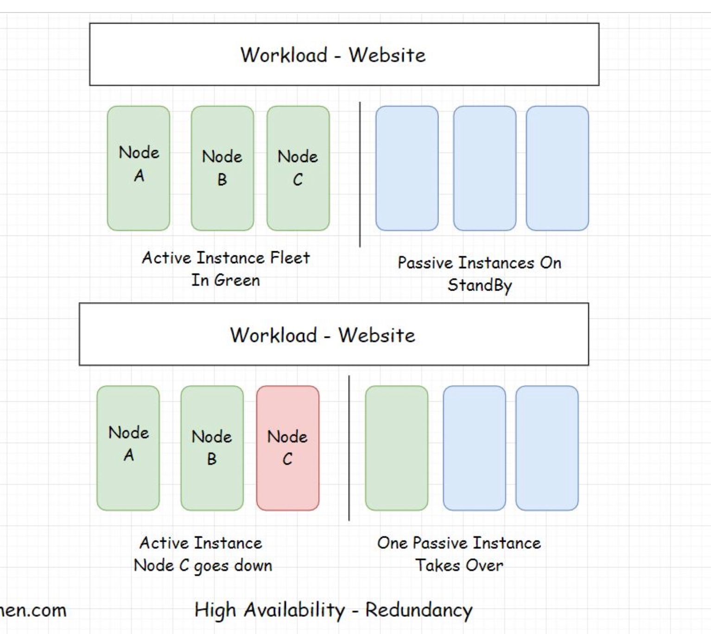
         3. An initial set of nodes are active & a set of redundant nodes are passive, on standby. Active nodes get replaced by passive nodes, in case of failures.
      2. Getting Rid Of Single Points Of Failure
         1. A large number of distributed nodes work in conjunction with each other to achieve a single synchronous application state.
         2. When so many redundant nodes are deployed, there are no single points of failure in the system.
      3. Monitoring & Automation
         1. Systems should be well monitored in real-time to detect any bottlenecks or single point of failures.
         2. Automation enables the instances to self-recover without any human intervention. It gives the instances the power of self-healing.
         3. Also, the systems become intelligent enough to add or remove instances on the fly as per the requirements.
   4. Replication
      1. Active-Active HA Mode
         1. This approach is also known as the Active-Active High Availability mode. In this approach, all the components of the system are active at any point in time.
         2. 
      2. Geographical Distribution of Workload
         1. This avoids the single point of failure thing in context to a data centre.
         2. Also, the latency is reduced by quite an extent due to the proximity of data to the user.
         3. Businesses often use multi-cloud platforms to deploy their workloads which ensures further availability. If things go south with one cloud provider, they have another to fail back over.
   5. High Availability Clustering
      1. A High Availability cluster also known as the Fail-Over cluster contains a set of nodes running in conjunction with each other that ensures high availability of the service.
      2. The nodes in the cluster are connected by a private network called the Heartbeat network that continuously monitors the health and the status of each node in the cluster.
      3. A single state across all the nodes in a cluster is achieved with the help of a shared distributed memory & a distributed co-ordination service like the Zookeeper.
      4. 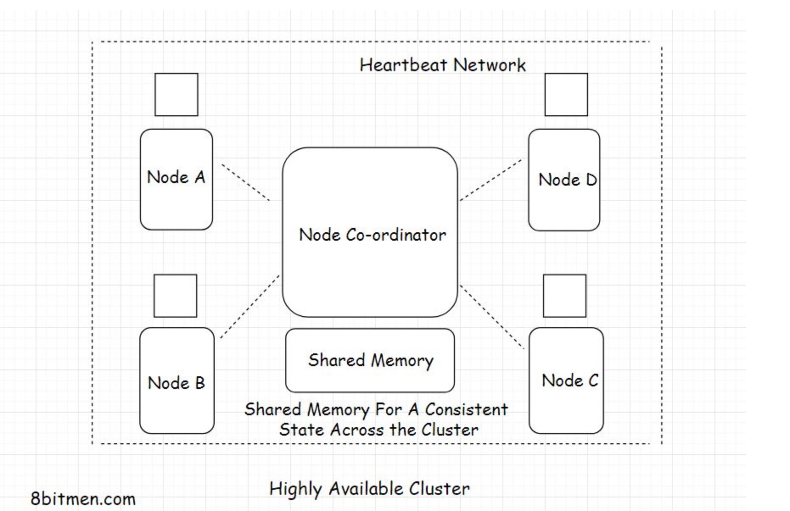
      5. techniques
         1. Disk mirroring
         2. RAID Redundant Array Of Independent Disks
         3. redundant network connections
         4. redundant electrical power
      6. Multiple HA clusters run together in one geographical zone ensuring minimum downtime & continual service.

## Load balancers

1. Intro
   1. What?
      1. Load balancers distribute heavy traffic load across the servers running in the cluster based on several different algorithms.
      2. Amidst processing a user request if a server goes down, the load balancer automatically routes the future requests to other up and running servers in the cluster thus enabling the service as a whole to stay available.
      3. Load balancers act as a single point of contact for all the client requests.
      4. efficiently manage traffic directed towards any component of the application be it the backend application server, database component, message queue or any other.
   2. Performing Health Checks Of The Servers With Load Balancers
      1. Load balancers regularly perform health checks of the machines in the cluster.
      2. maintains a list of machines that are up and running in the cluster in real-time
      3. in-service Nodes
      4. out of service Nodes
2. Understanding DNS (Domain name system)
   1. What?
      1. DNS is a system that averts the need to remember long IP addresses to visit a website by mapping easy to remember domain names to IP addresses.
   2. Components
      1. DNS querying is the process of resolving the domain name
      2. components
         1. DNS Recursive Nameserver aka DNS Resolver
         2. Root Nameserver
         3. Top-Level Domain Nameserver
         4. Authoritative Nameserver
      3. 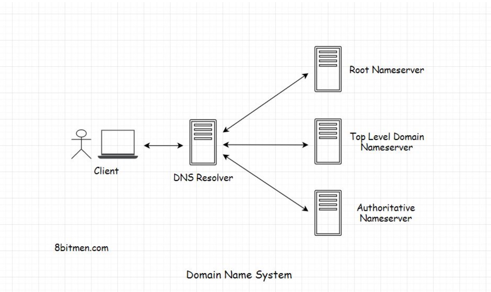
   3. Flow
      1. 
      2. user hits enter after typing in the domain name
      3. the browser sends a request to the DNS Recursive nameserver which is also known as the DNS Resolver.
      4. DNS resolver receive the client request and forward it to the Root nameserver to get the address of the Top-Level domain nameserver.
         1. DNS Recursive nameserver is generally managed by our ISP Internet service provider.
         2. The whole DNS system is a distributed system setup in large data centers managed by internet service providers.
         3. These data centers contain clusters of servers that are optimized to process DNS queries in minimal time that is in milliseconds.
      5. The Root nameserver returns the address of the Top-Level domain nameserver in response.
         1. As an example, the top-level domain for amazon.com is .com.
      6. Once the DNS Resolver receives the address of the top-level domain nameserver, it sends a request to it to fetch the details of the domain name.
         1. Top level domain nameservers hold the data for domains using their top-level domains.
         2. For instance, .com top-level domain nameserver will contain information on domains using .com.
      7. Once the top-level domain name server receives the request from the Resolver, it returns the IP address of amazon.com domain name server.
         1. amazon.com domain name server is the last server in the DNS query lookup process.
         2. It is the nameserver responsible for the amazon.com domain & is also known as the Authoritative nameserver
         3. This nameserver is owned by the owner of the domain name.
      8. DNS Resolver then fires a query to the authoritative nameserver & it then returns the IP address of amazon.com website to the DNS Resolver.
      9. DNS Resolver caches the data and forwards it to the client.
      10. On receiving the response, the browser sends a request to the IP address of the amazon.com website to fetch data from their servers.
      11. DNS information of websites that we visit also gets cached in our local machines
3. DNS load balancing
   1. What?
      1. DNS load balancing is implemented at autorative name server
      2. the authoritative server changes the order of the IP addresses in the list in a round-robin fashion.
      3. List of IPs is sent because if one ip failes client can try another IP
      4. it re-orders the list and puts another IP address on the top of the list following the round-robin algorithm.
      5. Also, when the client hits an IP it may not necessarily hit an application server, it may hit another load balancer implemented at the data center level that manages the clusters of application servers.
   2. Pros and cons
      1. Pros
         1. easy and less expensive
         2. distribute traffic across multiple data centers that the application runs in.
      2. Cons
         1. doesn’t take into account the existing load on the servers, the content they hold, their request processing time, their in-service status and so on.
         2. caching in client side causes request to land on machines that down
4. Load balancing methods
   1. Three modes
      1. DNS Load Balancing
      2. Hardware-based Load Balancing
      3. Software-based Load Balancing
   2. Hardware Load Balancers
      1. Pros
         1. highly performant physical hardware
         2. primarily picked because of their top-notch performance.
      2. Cons
         1. they need maintenance & regular updates
         2. expensive to setup in comparison to software load balancers and their upkeep may require a certain skill set.
         3. developers prefer working with software load balancers.
         4. have to overprovision them to deal with the peak traffic
   3. Software Load Balancers
      1. Pros
         1. can be installed on commodity hardware and VMs.
         2. cost-effective
         3. flexibility to the developers
         4. can be upgraded and provisioned easily
         5. LBaaS Load Balancers as a Service services -> no setup
         6. they consider many parameters such as content that the servers host, cookies, HTTP headers, CPU & memory utilization, load on the network & so on to route traffic across the servers.
         7. continually perform health checks on the servers
         8. Development teams prefer to work with software load balancers
         9. HAProxy is one example of a software load balancer
   4. Algorithms/Traffic Routing Approaches Leveraged By Load Balancers
      1. Round Robin & Weighted Round Robin
         1. Parameters such as load on the servers, their CPU consumption and so on are not taken into account when sending the IP addresses to the clients.
         2. Weighted Round Robin where based on the server’s compute & traffic handling capacity weights are assigned to them. And then based on the server weights, traffic is routed to them using the Round Robin algorithm.
         3. More traffic can be directed to the larger data centers containing more machines.
      2. Least Connections
         1. Normal approach
            1. it is assumed that all the requests will consume an equal amount of server resources
            2. there is a possibility that the machine having the least open connections might be already processing requests demanding most of its CPU power.
         2. Efficient approach
            1. the CPU utilization & the request processing time of the chosen machine is also taken into account before routing the traffic to it.
         3. used in persistent connections in a gaming application.
      3. Random
         1. the traffic is randomly routed to the servers
      4. Hash
         1. The source IP and request URL are hashed
         2. It ensures that request from same ip will always land on same machine
         3. Server would have cached requests for that user
         4. Reduces rtt of the request
         5. Re-establish connection with the same server incase of connection drops

## Monolith & Microservices

1. What is Monolith?
   1. 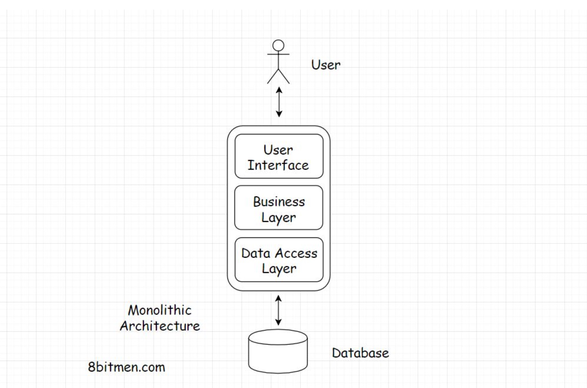
   2. self-contained, single-tiered software application
   3. different modules are responsible for running respective tasks
   4. Layers
      1. 
   5. Stripping down things in a tightly coupled architecture & re-writing stuff demands a lot of resources & time.
2. When Monolith?
   1. Pros
      1. Simplicity
      2. Easy monitoring
   2. Cons
      1. Continuous Deployment -> needs downtown of whole system
      2. Regression Testing -> need full testing for each deployment
      3. Single Points Of Failure
      4. Scalability Issues
      5. Cannot Leverage Heterogeneous Technologies
      6. Not Cloud-Ready, Hold State -> holds state in static variables
   3. When?
      1. requirements are pretty simple
      2. won’t be an exponential growth
3. What is Micorservices?
   1. In a microservices architecture, different features/tasks are split into separate respective modules/codebases which work in conjunction with each other forming a large service as a whole.
   2. Single Responsibility & the Separation of Concerns principles are applied
   3. easier & cleaner app maintenance, feature development, testing & deployment
   4. To scale, we need to split things up
   5. Every service ideally has a separate database, there are no single points of failure & system bottlenecks.
   6. 
4. When Microservice?
   1. Pros
      1. Leverage the Heterogeneous Technologies
         1. interacts with each other via a REST API Gateway interface.
         2. Polyglot persistence -> multiple databases types like SQL, NoSQL together in an architecture
      2. Independent & Continuous Deployments
   2. Cons
      1. Complexities In Management
         1. Managing & monitoring them gets complex.
         2. Additional components needed like Apache Zookeeper, a distributed tracing service for monitoring the nodes etc.
         3. more skilled resources
      2. No Strong Consistency
         1. Things are Eventually consistent across the nodes.
         2. this limitation is due to the distributed design.
   3. When?
      1. complex use cases
      2. expect traffic to increase exponentially in future
      3. A typical social networking application has various components such as messaging, real-time chat, LIVE video streaming, image uploads, Like, Share feature etc.
5. Stratergies to go with
   1. pick a monolith
   2. pick a microservice
   3. pick monolith and later scale into microservice
6. Tradeoffs
   1. Fault Isolation
      1. microservices
         1. easy for us to isolate faults and debug them
         2. fix issues on that perticular microservice
   2. Development Team Autonomy
      1. Monolith
         1. as the size of the codebase increases, the compile-time & the time required to run the tests increases too.
         2. Code change made by any other team will directly impact the feature we develop
         3. Thorough regression testing is required
         4. Code pushed might require approval from other teams
      2. Microservice
         1. separate teams have complete ownership of their codebases.
         2. complete development and deployment autonomy over their modules
         3. Code management becomes easier
         4. It becomes easier to scale individual services
         5. launch a lot of features quick
         6. Distributed logging, monitoring, inter-service communication, service discovery, alerts, tracing, build & release pipelines, health checks & so on.
   3. Segment - case study -> from monolith to microservice to monolith
      1. Monolith
         1. 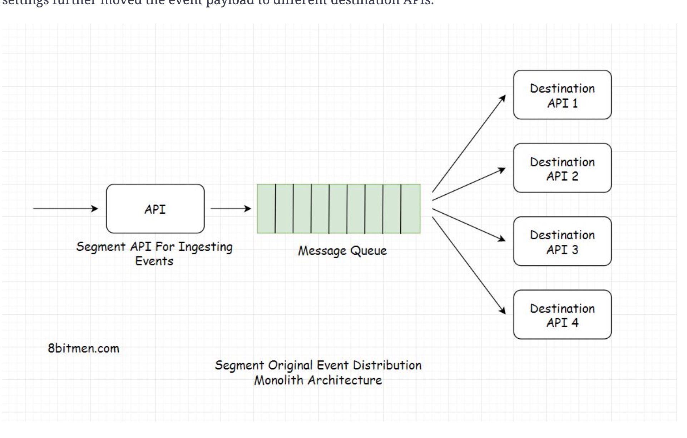
         2. Segment’s data infrastructure ingests hundreds of thousands of events per second.
         3. These events are then directed to different APIs & webhooks via a message queue.
      2. Microservice
         1. 
         2. Every destination had a separate microservice and a queue.
         3. Auto-scaling was implemented in the infrastructure but every service had distinct CPU & memory requirements.
         4. This needed manual tuning of the infrastructure. This meant - more queues needed more resources for maintenance.

## Micro Frontends

1. Intro
   1. Micro frontends are separate loosely coupled components of the user interface of an application that are developed applying the principles of microservices on the front end.
   2. loosely coupled
   3. fault isolation
   4. freedom to pick the desired technology stack
   5. 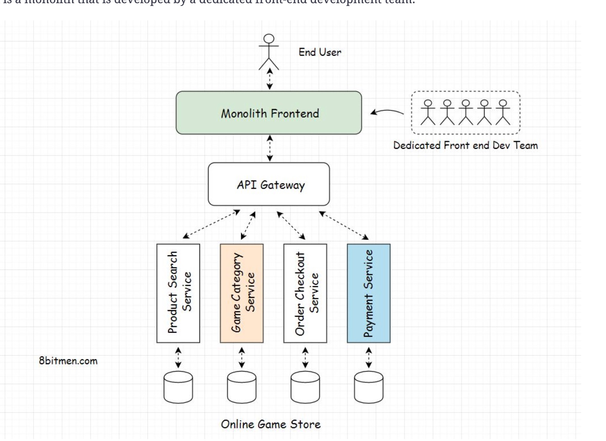
   6. 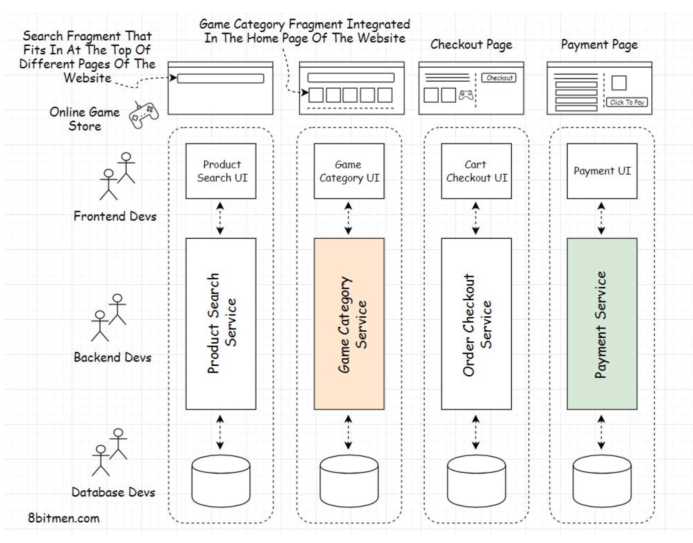
2. Need
   1. Easier Co-ordination With The Front End Devs
   2. Leveraging The Right Technology
3. Micro Frontends Integration
   1. Client-Side Integration Of Micro Frontends
      1. integrating components on the client is having micro frontends with unique links.
      2. he micro frontends that need to be integrated within a specific page can be done using Iframes.
   2. Server-Side Integration
      1. on the user request the complete pre-built page of the website is delivered to the client from the server
      2. This cuts down the loading time of the website on the client significantly since the browser does not have to do any sort of heavy lifting.

## Database

1. Introduction & Types of Data
   1. What is database?
      1. a component required to persist data
      2. many forms: structured, unstructured, semi-structured and user state data.
   2. Structured Data
      1. typically stored in a database in a normalized fashion.
      2. Direct interaction can be done with this kind of data.
      3. generally managed by a query language such as SQL (Structured query language).
   3. Unstructured Data
      1. no definite structure.
      2. comprising of text, image files, video, multimedia files, pdfs, Blob objects, word documents, machine-generated data etc.
      3. often encountered in data analytics.
      4. data streams in from multiple sources such as IoT devices, social networks, web portals, industry sensors etc. into the analytics systems.
      5. cannot just directly process unstructured data.
      6. Data prep is needed
   4. Semi-structured Data
      1. mix of structured & unstructured data.
      2. often stored in data transport formats such as XML or JSON and is handled as per the business requirements.
   5. User state
      1. information of activity which the user performs on the website.
      2. next time, when the user logs in, he can continue from where he left off.
      3. Improves user experience
2. Relational Database
   1. What?
      1. A relational database saves data containing relationships.
      2. One to One, One to Many, Many to Many, Many to One etc.
   2. What Are Relationships?
      1. One-to-One
      2. One-to-Many
      3. Many-to-Many
      4. Parent Tables and Child Tables
   3. Data Consistency
      1. normalization
      2. simplest and atomic form and is not spread throughout the database
      3. if we want to update the data, we just update at that one place and every fetch operation gets the updated data.
   4. ACID Transactions
      1. ACID
         1. Atomicity
         2. Consistency
         3. Isolation
         4. Durability
            1. Transaction states before and after are consistent and durable
   5. When?
      1. Transactions & Data Consistency
         1. money or numbers, that makes transactions, ACID, data consistency super important to you.
         2. shine when it comes to transactions & data consistency.
      2. Storing Relationships
3. NoSQL Databases
   1. What?
      1. more like JSON-based databases
      2. built for high frequency read & writes
   2. Differences
      1. Scalability
         1. RDBMS
            1. Scaling relational databases is something which is not trivial
            2. They have to be Sharded or Replicated to make them run smoothly on a cluster.
         2. NoSQL
            1. ability to add new server nodes on the fly & continue
      2. Clustering
         1. designed to run intelligently on clusters.
         2. server nodes even have self-healing capabilities
         3. sacrifice Strong consistency, ACID Transactions & much more to scale horizontally over a cluster & across the data centres.
         4. Eventually Consistent
   3. Features
      1. Pros
         1. Gentle Learning Curv
         2. Schemaless
      2. Cons
         1. Inconsistency
         2. No Support For ACID Transactions
   4. When?
      1. Handling A Large Number Of Read Write Operations
         1. large amount of data
         2. Frequent read/writes
      2. Flexibility With Data Modeling
      3. Eventual Consistency Over Strong Consistency
         1. we do not require transactions.
         2. When a large application is deployed on hundreds of servers spread across the globe, the geographically distributed nodes take some time to reach a global consensus. (Eventual Consistency)
      4. Running Data Analytics
         1. data analytics use cases
         2. influx of massive amounts of data.
   5. Performance
      1. NoSQL and RDBMS have similar performant from benchmarks
      2. Performance entirely depends on the application & the database design.
         1. Using more joins in SQL
         2. Removing all joins and relationships, SQL will become NoSQL
      3. A well-designed SQL data store will always be more performant than a not so well-designed NoSQL store.
4. Polyglot Persistence
   1. What?
      1. Polyglot persistence means using several different persistence technologies to fulfil different persistence requirements in an application.
   2. Facebook  use case
      1. 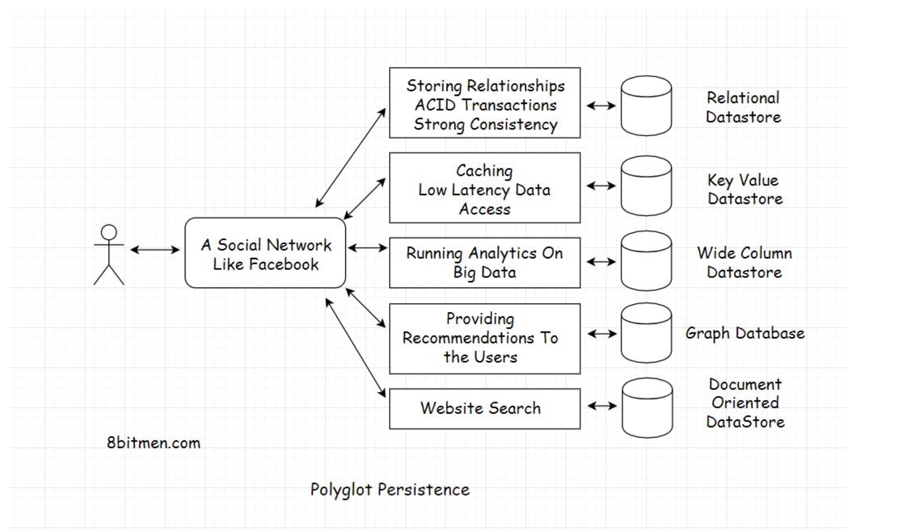
      2. RDBMS to to persist relationships (mysql)
      3. Key Value store to cache (memcache)
      4. Wide Column db for analytics (cassandra)
      5. RDBMS for transactions (mysql)
      6. Graph DB for recommendations (GraphQL)
      7. Document Oriented Store for scalable search (ElasticSearch)
   3. Downside is complexity alone
5. Multi-Model Databases
   1. What?
      1. 
      2. ability to use different data models in a single database system.
      3. Multi-model databases support multiple data models like Graph, Document-Oriented, Relational etc. as opposed to supporting only one data model.
   2. Arango DB, Cosmos DB, Orient DB, Couchbase etc.
6. Eventual Consistency
   1. What?
      1. The consistency is maintained over time
   2. enables the data store to be highly available.
   3. optimistic replication
   4. Use case
      1. Update like counter in blogging site, request from japan and other countries
      2. 
      3. All the nodes in different geographic zones have different post values. And they will take some time to reach a consensus.
7. Strong Consistency
   1. What?
      1. Strong Consistency simply means the data has to be strongly consistent at all times.
      2. only way to implement this behaviour is by locking down the nodes when being updated.
   2. Use Case
      1. Lock the node until update is propagated to all nodes
      2. 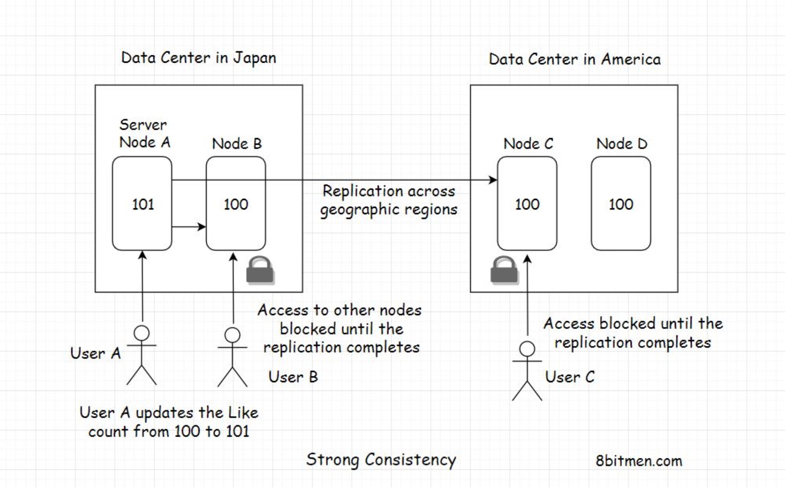
      3. Used in stock market trading apps
   3. picking the Strong Consistency model hits the capability of the system to be Highly Available.
   4. ACID Transaction Support
      1. NoSQL databases don’t support ACID transactions
      2. transaction support is limited to a geographic zone
      3. Developers of the tech make sure that all the Strongly consistency entity nodes reside in the same geographic zone to make the ACID transactions possible.
8. CAP Theorem
   1. CAP stands for Consistency, Availability, Partition Tolerance.
   2. Partition Tolerance means Fault Tolerance.The system is tolerant of failures or partitions. It keeps working even if a few nodes go down.
   3. amongst the three, Consistency, Availability & the Partition Tolerance, we have to pick two.
   4. CAP theorem simply states that in case of a network failure, when a few of the nodes of the system are down, we have to make a choice between Availability & Consistency
   5. If we pick Availability that means when a few nodes go down, the other nodes are available to the users for making updates.
   6. If we pick Consistency, in that scenario, we have to lock down all the nodes for further writes until the nodes which have gone down come back online
   7. depends on our use case and the business requirements.
   8. Nodes, spread around the globe, will take some time to reach a consensus.
9. Types of Databases
   1. Types
      1. Document-Oriented database
      2. Key-value datastore
      3. Wide-column database
      4. Relational database
      5. Graph database
      6. Time-Series database
      7. Databases dedicated to mobile apps
10. Document Oriented Database
    1. What?
       1. They store data in a document-oriented model in independent documents.
       2. The data is generally semi-structured & stored in a JSON-like format.
    2. MongoDB, CouchDB, OrientDB, Google Cloud Datastore, Amazon Document DB
    3. When?
       1. need a flexible schema which would change often
       2. possibility that things might change over time.
       3. there isn’t much relational logic involved & all we need is just quick persistence & retrieval of data.
       4. Typical usecases
          1. Real-time feeds
          2. Live sports apps
          3. Writing product catalogues
          4. Inventory management
          5. Storing user comments
          6. Web-based multiplayer games
11. Graph Database
    1. What?
       1. They store data in nodes/vertices and edges in the form of relationships.
       2. 
       3. Each Node in a graph database represents an entity.
    2. Features Of A Graph Database
       1. visualization
       2. low latency
       3. faster as the relationships in them are not calculated at the query time
    3. When?
       1. social, knowledge, network graphs.
       2. AI-based apps, recommendation engines, fraud analysis app, storing genetic data etc.
    4. Neo4J is standard
12. Key Value Database
    1. What?
       1. These databases use a simple key-value method to store and quickly fetch the data with minimum latency.
    2. Features
       1. caching
       2. Key is unique Identifier
       3. Key-value databases can be fetched in constant time O(1)
    3. Redis, Hazelcast, Riak, Voldemort & Memcache.
    4. When?
       1. fetch data real fas
       2. Typical use cases
          1. Caching
          2. Persisting user state
          3. Persisting user sessions
          4. Managing real-time data
          5. Implementing queues
          6. Creating leaderboards in online games & web apps
          7. Implementing a pub-sub system
13. Time Series Database
    1. What?
       1. Time-Series databases are optimized for tracking & persisting time series data.
       2. Time Series Data is the data containing data points associated with the occurrence of an event with respect to time.
       3. These data points are tracked, monitored and then finally aggregated based on certain business logic.
    2. IoT devices, self-driving vehicles, industry sensors, social networks, stock market financial data etc.
    3. Why?
       1. Studying data, streaming-in from applications helps us track the behaviour of the system
       2. It helps us study user patterns, anomalies & how things change over time.
       3. running analytics, deducing conclusions and making future business decisions
    4. Influx DB, Timescale DB, Prometheus etc.
    5. When?
       1. need to manage data in real-time & continually over a long period of time
       2. fetching data from IoT devices.
       3. Managing data for running analytics & monitoring.
       4. deals with changing stock prices in real-time etc.
14. Wide-Column Database
    1. What?
       1. databases store data in a record with a dynamic number of columns.
       2. A record can hold billions of columns.
       3. primarily used to handle massive amounts of data, technically called the Big Data.
       4. perfect for analytical use cases.
    2. Cassandra, HBase, Google BigTable, Scylla DB etc.
    3. When?
       1. grapple with Big data, to ingest it or to run analytics on it
       2. manage big data ensuring scalability, performance & high availability at the same time.

## Caching

1. Intro
   1. What?
      1. simply means copying frequently accessed data from the database which is disk-based hardware and storing it in RAM Random Access Memory hardware.
      2. It ensures low latency and high throughput.
      3. it returns the response in less time
   2. Caching Dynamic Data
      1. it has an expiry time or a TTL “Time To Live”.
      2. After the TTL ends, the data is purged from the cache and the newly updated data is stored in it. This process is known as Cache Invalidation.
   3. Caching Static Data
      1. images, font files, CSS & other similar files.
      2. cached on the client-side in the browser or their local memory.
      3. on the CDNs the Content Delivery Networks.
   4. helps applications maintain their expected behaviour during network interruptions.
2. When and where?
   1. When?
      1. it’s always a good idea to use a cache
      2. used at any layer of the application
      3. common usage of caching is database caching.
   2. Where?
      1. client browser to cache static data.
      2. database
      3. We can always cache the frequently accessed content on our website
      4. user sessions in a cache.
      5. OS level
      6. at the network level
      7. CDN
      8. Key-Value store
      9. cross-module communication in a microservices architecture by saving the shared data
      10. DB writes can be batched using cache
3. Caching Strategies
   1. Cache Aside
      1. The data is lazy-loaded in the cache.
      2. Flow
         1. User requests
         2. Look into cache
         3. if present return
         4. or hit db and add in cache
         5. Item deleted from cache after TTL
      3. When?
         1. Read heavy system
         2. rare updates
   2. Read-Through
      1. cache always stays consistent with the database.
      2. Flow
         1. User requests
         2. Look into cache
         3. if present return
         4. or hit db and update cache
         5. Cache service syncs writes to db and cache
         6. Item deleted from ache after TTL
      3. When?
         1. When we want consistent cache
   3. Write-Through
      1. each & every information written to the database goes through the cache.
      2. Flow
         1. User writes data
         2. It updates cache
         3. writes to db
      3. When?
         1. Write heavy systems
         2. games
   4. Write-Back
      1. Cache updated and later writtern to DB
      2. Flow
         1. User writes data
         2. Updated in cache
         3. after some time updated in DB
      3. When?
         1. Write heavy system
         2. It might loose consistency when cache dies before updating db

## Message Queue

1. Intro
   1. What?
      1. Message queue as the name says is a queue which routes messages from the source to the destination or we can say from the sender to the receiver.
      2. follows the FIFO (First in First Out) policy.
      3. sent first is delivered first.
      4. They also support priority
      5. 
   2. Features
      1. facilitate asynchronous behaviour.
      2. cross-module communication which is key in service-oriented or microservices
      3. communication in a heterogeneous environment.
      4. temporary storage for storing messages
   3. Use Cases
      1. Emails
      2. BG tasks
      3. Async behaviour
      4. Notification systems
      5. Batch process
   4. Message queues size can be infinite
2. Publisher Subscriber Model
   1. What?
      1. A Publish-Subscribe model is the model where multiple consumers receive the same message sent from a single or multiple producers.
      2. 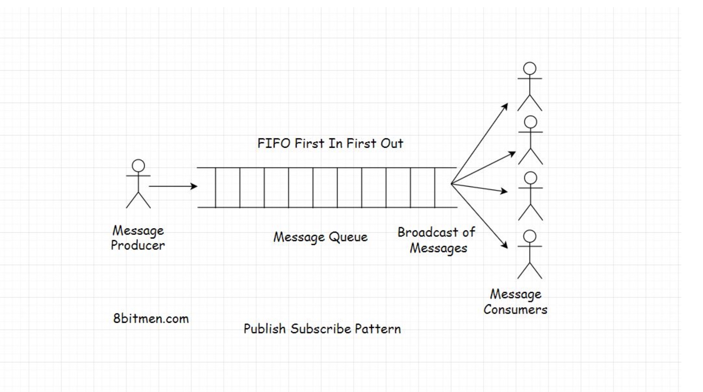
   2. Exchanges
      1. exchanges which further push the messages to the queues based on the exchange type
      2. The relationship between exchange and the queue is known as Binding.
      3. 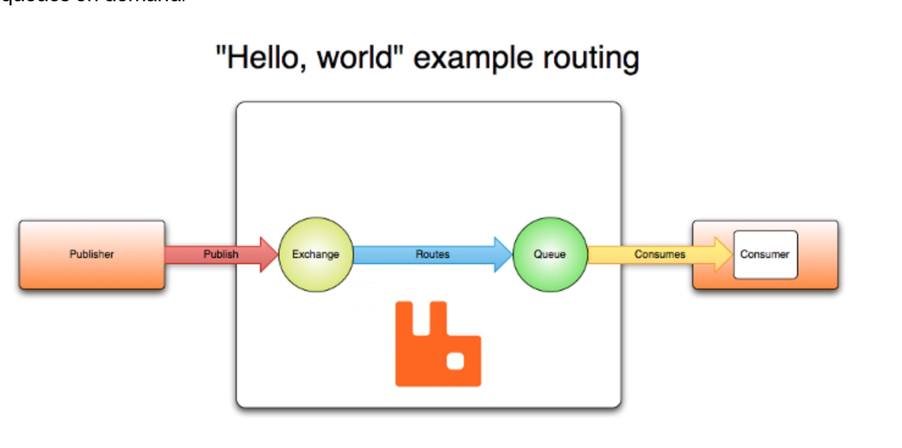
      4. 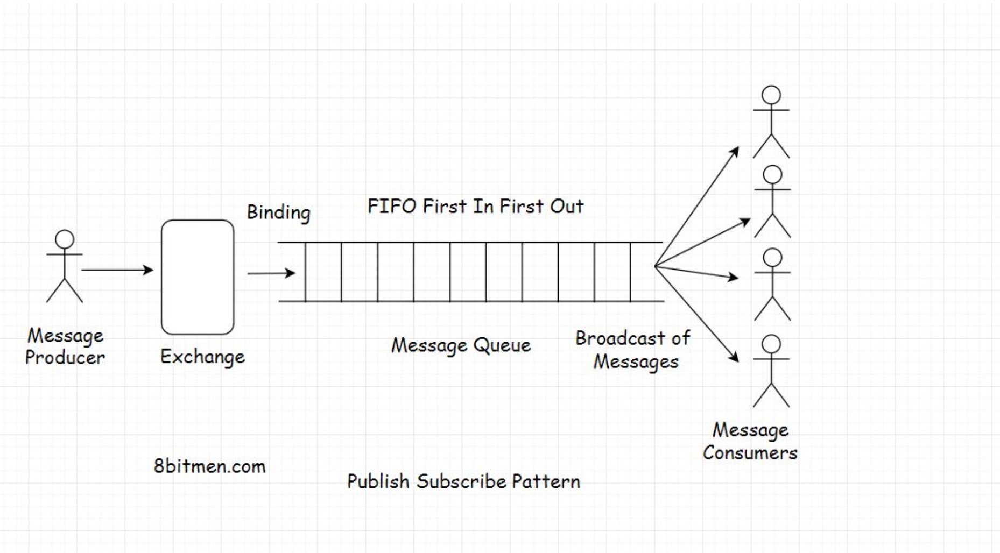
      5. Some Types
         1. Direct
            1. 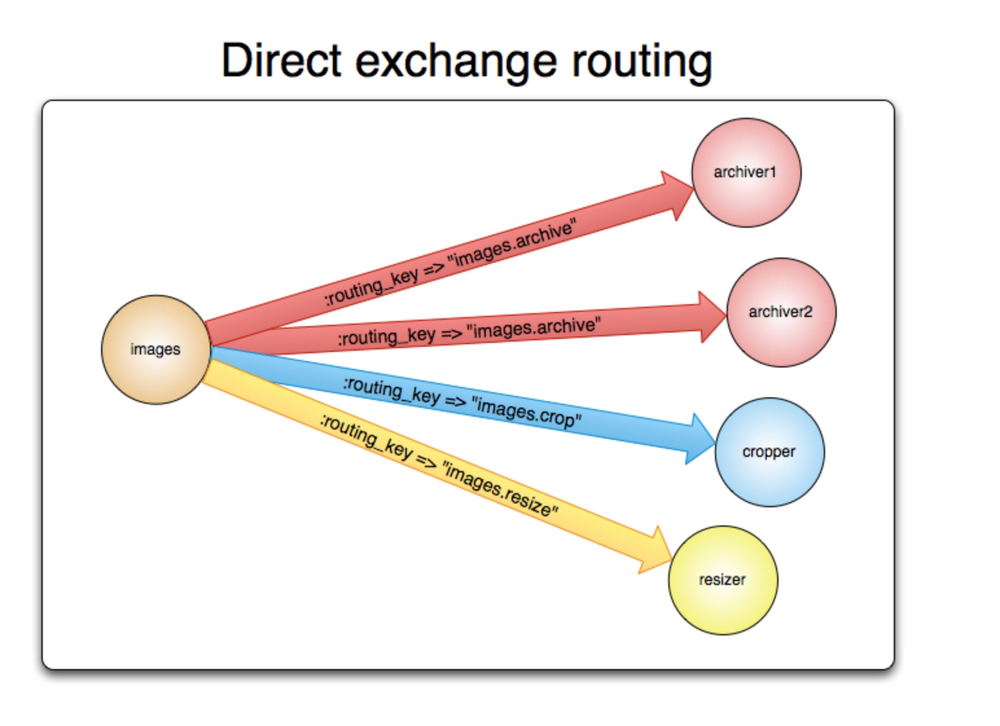
         2. Topic
            1. route messages to one or many queues based on matching between a message routing key and the pattern that was used to bind a queue to an exchange.
            2. used in pub sub model
            3. Use case
               1. Distributing data
               2. Background task processing done by multiple workers
         3. Fanout
            1. routing key is ignored
            2. 
         4. Headers
3. Point to Point Model
   1. What?
      1. Point to point communication is a pretty simple use case where the message from the producer is consumed by only one consumer.
      2. one to one relationship, publish-subscribe model is a one to many relationship.
      3. A message sent is only consumed by one consumer
   2. Protocols -> AMQP Advanced Message Queue Protocol & STOMP Simple or Streaming Text Oriented Message Protocol.
   3. Tech -> RabbitMQ, ActiveMQ, Apache Kafka
4. Notification Systems & Real-time Feeds with Message Queues
   1. Social Media Use Case
      1. Polling
         1. 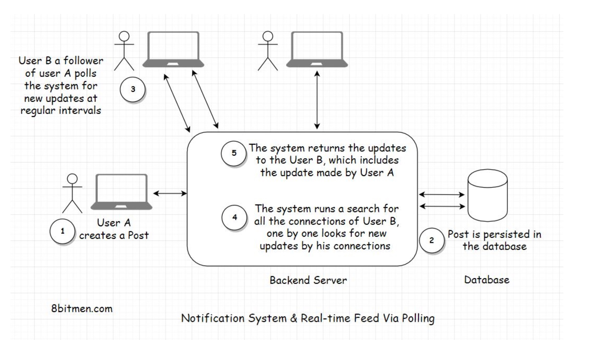
      2. Pushing
         1. 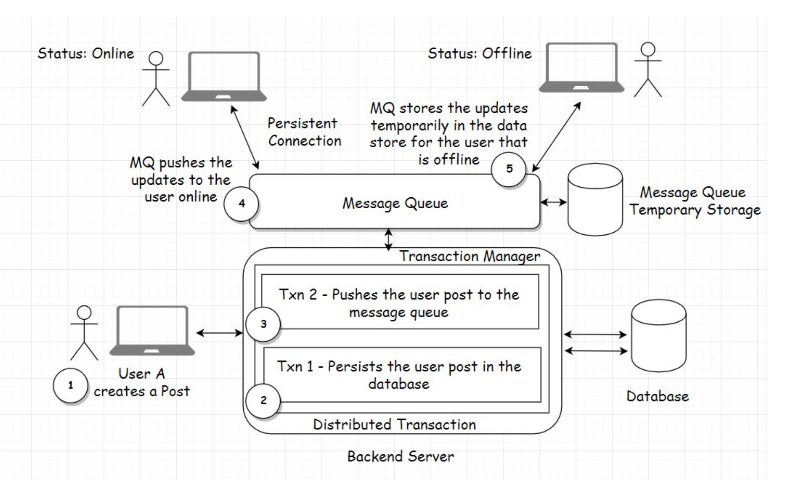
5. Handling Concurrent Requests With Message Queues
   1. Updating likes counter
      1. Likes counter from different services can be updated by queueing concurrent requests
   2. Herd cache
      1. Multiple same cache miss can be avoided by queueing same cache requests

## Stream Processing

1. Intro
   1. To manage the massive amount of streaming data we need to have sophisticated backend systems in place to gather meaningful information from it and archive/purge not so meaningful data.
   2. Used in Data-Driven Systems
   3. Use cases
      1. IoT devices
      2. wearable healthcare body sensors
      3. tracking the service efficiency, for instance, getting Everything Is Okay signal from the IoT devices used by millions of customers.
   4. Time-series databases is used
2. Data Ingestion
   1. What?
      1. Data Ingestion is a collective term for the process of collecting data streaming-in from several different sources and making it ready to be processed by the system.
      2. routed to different components/layers through the data pipelines, algorithms are run on it and is eventually archived.
   2. Layers
      1. Data collection layer
      2. Data query layer
      3. Data processing layer
      4. Data visualization layer
      5. Data storage layer
      6. Data security layer
   3. 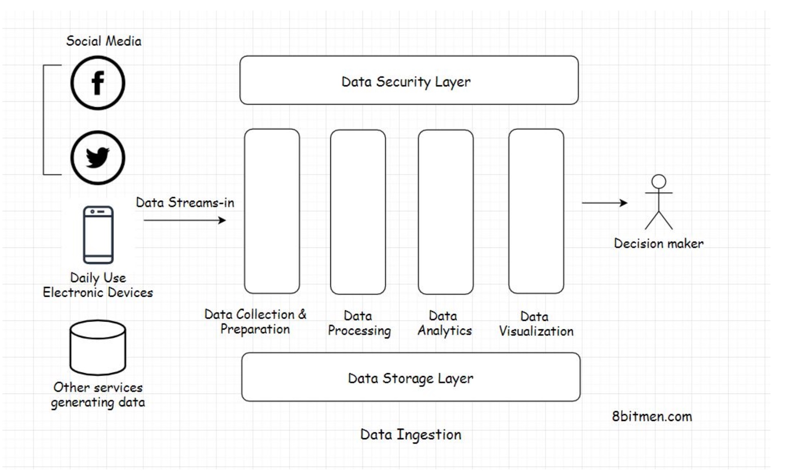
   4. Data Standardization
      1. Data streams-in into the system at different speeds & sizes
      2. Every stream of data has different semantics.
      3. This process of data standardization occurs in the Data collection and preparation layer.
   5. Data Processing
      1. processed based on the business requirements
      2. It is generally classified into different flows, routed to different destinations.
   6. Data Analysis
      1. analytics is run on the data
      2. predictive modelling, statistical analytics, text analytics etc.
   7. Data Visualization
      1. presented before the stakeholders
      2. Kibana is one good example of a data visualization tool
   8. Data Storage & Security
      1. ensures the secure movement of data all along.
3. Ways of Data Injestion
   1. Two primary ways
      1. Real-time
         1. typically preferred in systems reading medical data
         2. financial data like stock market events
      2. Batches which run at regular intervals.
         1. read trends over time
         2. popularity of a sport in a region
   2. Challenges
      1. Slow Process
         1. Because of data transformation, staging, transporting, security
         2. Performing analytics on whole data gives better result that performing on real time data
      2. Complex & Expensive
         1. resource-intensive.
         2. semantics of the data coming from externals sources changes sometimes
      3. Moving Data Around Is Risky
4. Use cases
   1. Moving Big Data Into Hadoop
   2. Streaming Data from Databases to Elasticsearch Server
      1. Updates in the database must be streamed into elasticsearch for effective searching
   3. Log Processing
      1. Basically stream logs to a central place for visualization
   4. Stream Processing Engines for Real-Time Events
      1. In sports analysis ingest data, analyse it, figure out the behaviour in real-time & quickly push the updated information to the fans.
5. Data Pipelines
   1. What?
      1. They facilitate the efficient flow of data from one point to another & also enable the developers to apply filters on the data streaming-in in real-time.
   2. Features Of Data Pipelines
      1. These ensure smooth flow of data.
      2. Enables the business to apply filters and business logic on streaming data.
      3. Avert any bottlenecks & redundancy in the data flow.
      4. Facilitate parallel processing of data.
      5. Avoid data being corrupted.
   3. work on a set of rules predefined by the engineering teams 
   4. entire flow of data extraction, transformation, combination, validation, converging of data from multiple streams into one etc. is completely automated.
   5. ETL systems don't support real time streaming
   6. What is ETL?
      1. Extract Transform Load.
      2. Extract means fetching data from single or multiple data sources
      3. Transform means transforming the extracted heterogeneous data into a standardized format based on the rules set by the business.
      4. Load means moving the transformed data to a data warehouse or another data storage location for further processing of data.
      5. entire movement of data is done in batches as opposed to streaming it, through the data pipelines, in real-time.
      6. batch processing approach is not obsolete.
6. Distributed Data Processing
   1. What?
      1. Distributed data processing means diverging large amounts of data to several different nodes, running in a cluster, for parallel processing.
      2. 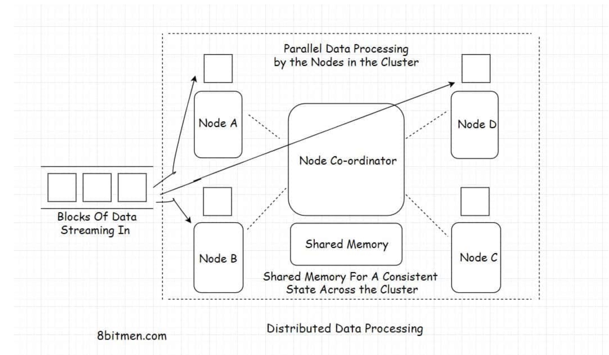
      3. Apache Zookeeper is a pretty popular, de-facto, node co-ordinator used in the industry.
      4. scalable & highly available.
      5. Data is made redundant & replicated across the cluster to avoid any sort of data loss.
   2. Technologies
      1. MapReduce – Apache Hadoop
         1. Map part of the programming model involves sorting the data based on a parameter
         2. Reduce part involves summarizing the sorted data.
      2. Apace Spark
         1. open-source cluster computing framework.
         2. Works with both batches and realtime data
         3. has a cluster manager and distributed data storage.
      3. Apache Storm
         1. Apache Storm is a distributed stream processing framework.
         2. massive amounts of streaming data.
         3. real-time analytics, machine learning, distributed remote procedure calls etc.
      4. Apache Kafka
         1. open-source distributed stream processing & messaging platform.
         2. The storage layer of Kafka involves a distributed scalable pub/sub message queue.
         3. real-time features such as notification platforms, managing streams of massive amounts of data, monitoring website activity & metrics, messaging, log aggregation.
      5. Hadoop is preferred for batch processing
      6. Spark, Kafka & Storm are preferred for processing real-time streaming data.
7. Lambda Architecture
   1. What
      1. 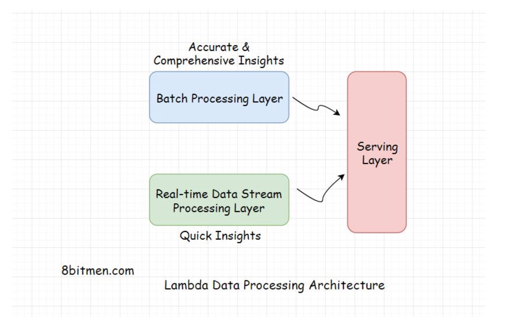
      2. distributed data processing architecture
      3. uses both batch processing & stream processing
      4. joins the results from both the approaches before presenting it to the end user.
   2. Layers
       1. Batch Layer
       2. Speed Layer
       3. Serving layer
8. Kappa Architecture
   1. What?
      1. 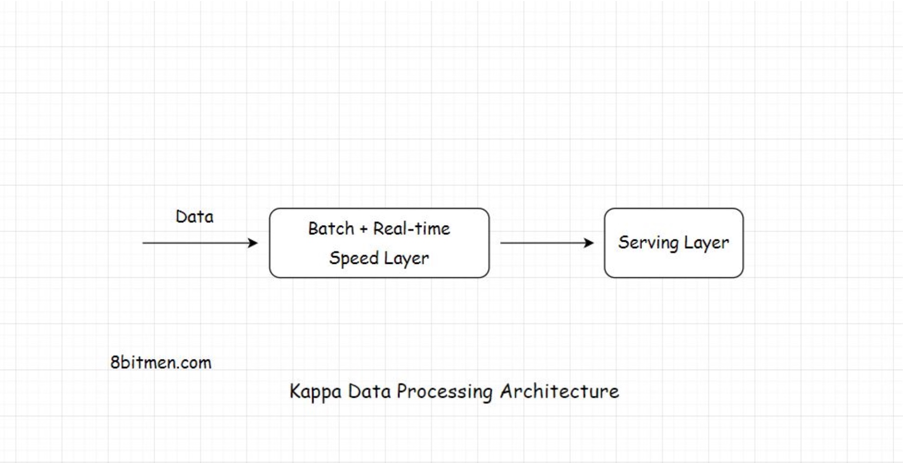
      2. In Kappa architecture, all the data flows through a single data streaming pipeline as opposed to the Lambda architecture which has different data streaming layers that converge into one.
      3. complexity is reduces
   2. Kappa is not an alternative for Lambda.
   3. Kappa is preferred if the batch and the streaming analytics results are fairly identical in a system.

## Software Architecture

1. Event Driven Architecture
   1. What Is Blocking?
      1. means the flow of execution is blocked waiting for a process to complete.
   2. What Is Non-Blocking?
      1. Code flow of execution continues by offloading task to a different thread/process
      2. This increases complexity and looses consistency for a while
   3. What Are Events?
      1. Two kinds of process
         1. CPU intensive
         2. IO intensive
            1. A large number of IO operations mean a lot of events occurring over a period of time.
            2. an event can be anything from a tweet to a click of a button, an HTTP request, an ingested message, a change in the value of a variable etc.
      2. Event-Driven Architecture
         1. Non-blocking architecture is also known as the Reactive or the Event-driven architecture.
            1. NodeJS is non blocking and event driven
            2. capable of handling a big number of concurrent connections with minimal resource consumption.
            3. reliable behaviour in a distributed environment.
            4. write code without worrying about handling multi-threads, thread lock, out of memory issues due to high IO etc.
         2. reacting to the events occurring regularly
         3. Event-driven architecture is all about processing asynchronous data streams.
         4. 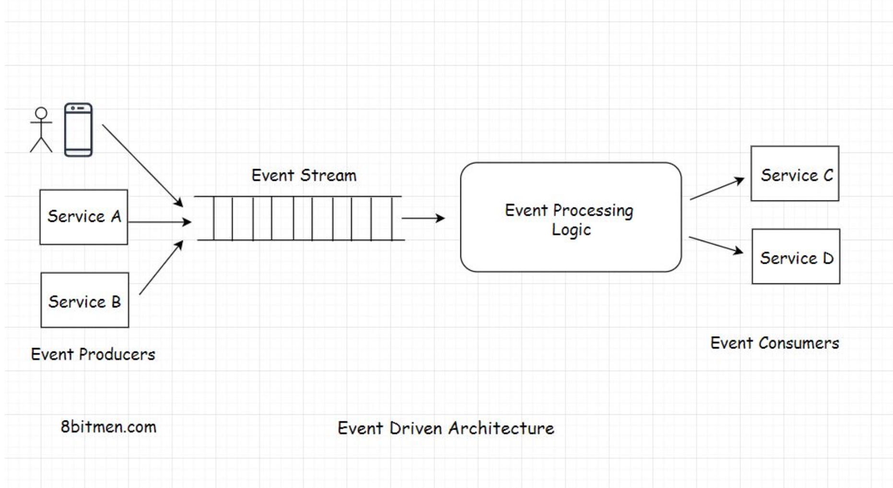
      3. Technologies
         1. Spring Reactor
         2. NodeJS is a single-threaded non-blocking framework written to handle more IO intensive tasks.
         3. NodeJS is not fit for CPU intensive tasks
2. Web Hooks
   1. What?
      1. WebHooks are more like call-backs. It’s like I will call you when new information is available. You carry on with your work.
      2. WebHooks enable communication between two services without a middleware.
      3. They have an event-based mechanism.
   2. How?
      1. 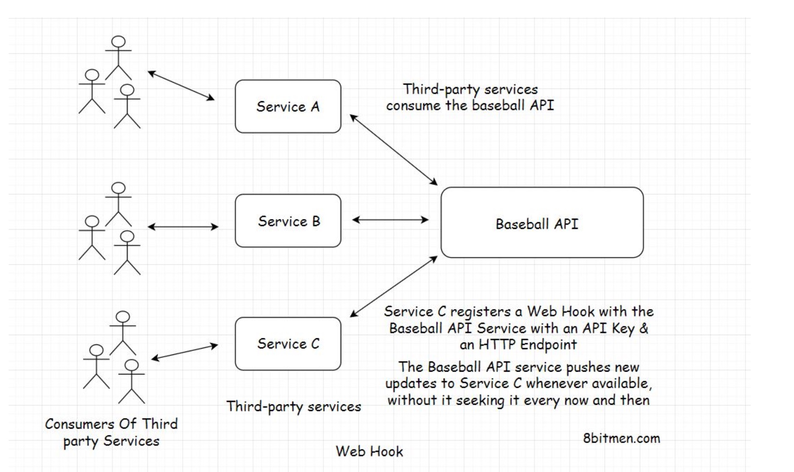
3. Shared Nothing
   1. Shared Nothing Architecture means eliminating all single points of failure. Every module has its own memory, own disk. So even if several modules in the system go down, the other modules online stay unaffected. It also helps with the scalability and performance.
4. Hexagonal Architecture
   1. Components
      1. Ports
      2. Adapters
      3. Domain
   2. What?
      1. 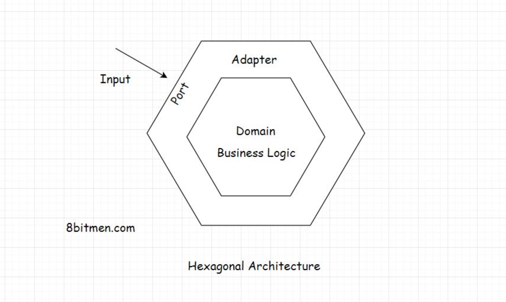
      2. independent, loosely coupled & easy to test.
      3. holds the domain at its core
      4. outer layer has Ports & Adapters.
   3. Ports
      1. Ports act like an API, as an interface
      2. All the input to the app goes through the interface.
      3. external entities don’t have any direct interaction with the domain
   4. Adapter
      1. Adapters convert the data obtained from the Ports, to be processed by the business logic.
      2. Intermediary between ports and domain
5. Peer to Peer Architecture
   1. What?
      1. base of blockchain tech, torrents etc.
      2. nodes can communicate with each other without the need of a central server.
      3. nodes can communicate with each other without the need of a central server.
      4. All the computers in the network have equal rights.
      5. 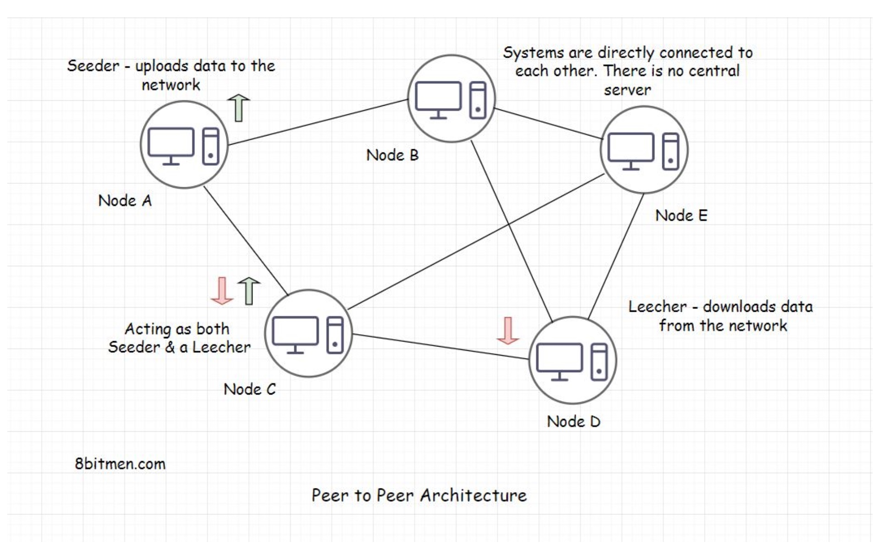
   2. Downsides Of Centralized Systems
      1. central server has access to all your messages.
      2. natural disaster
      3. Moderation
   3. What Is A Decentralized Architecture?
      1. Nobody has control over your data,
      2. nobody has the power to delete your data
      3. P2P network have equal rights
   4. Advantages
      1. P2P file sharing
   5. How?
      1. data is exchanged over TCP IP just like it happens over the HTTP protocol in a client-server model.
      2. P2P design has an overlay network over TCP IP which enables the users to connect directly
      3. Nodes/Peers are indexed & discoverable in this overlay network.
   6. Types
      1. Unstructured Network
         1. nodes/peers keep connecting with each other randomly.
         2. no indexing of the nodes.
         3. Scan through each & every node of the network for file. (O(n))
         4. Gossip, Kazaa & Gnutella
      2. Structured Network
         1. holds proper indexing of the nodes or the topology which makes it easier to search for a specific data in it.
         2. Distributed hash table to index the nodes.
         3. BitTorrent
      3. Hybrid Model
         1. involving both a peer to peer & a client-server model.
      4. Tradepal, BitCoin, GitTorrent, Twister, Diaspora
6. Decentralized Social Networks
   1. What?
      1. Nobody has autonomous control over the network, everybody has an equal say.
      2. host our data from our systems
   2. Minds, Mastodon, Diaspora, Friendica, Sola etc.
   3. Features
      1. Bring Your Own Data
      2. Ensuring the Safety of Our Data
      3. Economic Compensation to the parties involved in the network
      4. Infrastructure Ease
7. Federated Architecture
   1. What?
      1. extension to the decentralized architecture.
      2. group of semi-autonomous entities exchanging information
   2. How?
      1. A large number of nodes subscribe to the pods.
      2. link between a few pods breaks temporarily. The network is still up.
      3. 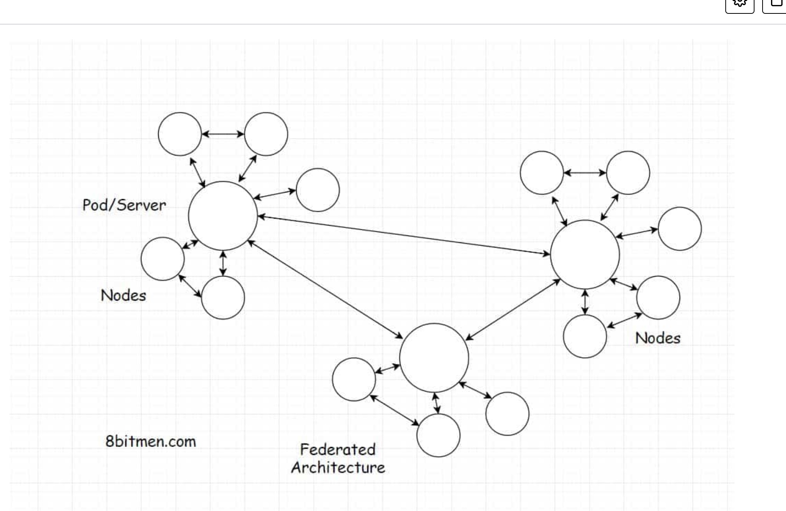
   3. Why?
      1. Pods facilitate node discovery.
