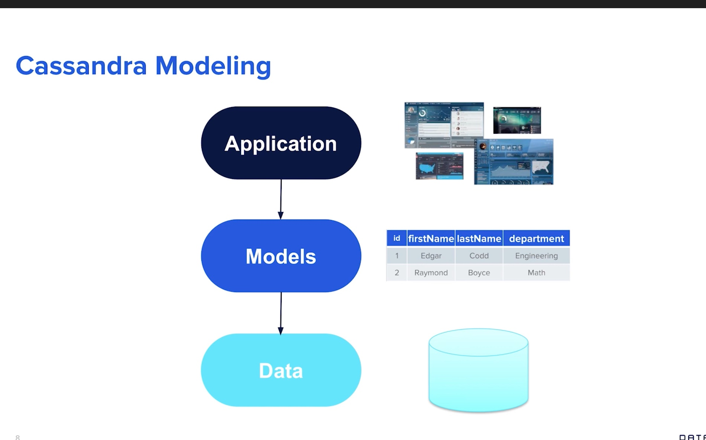
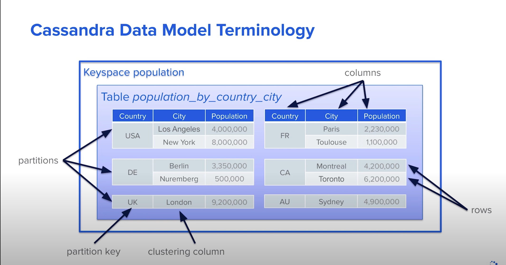
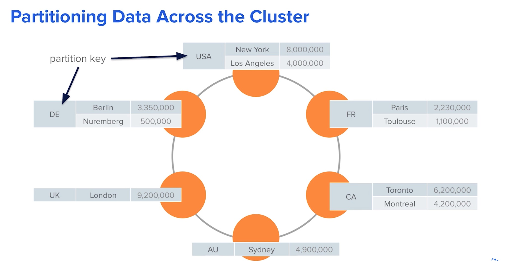
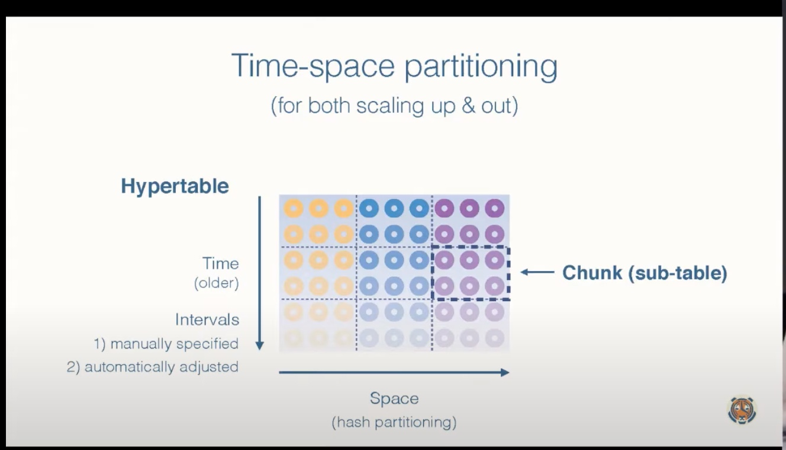
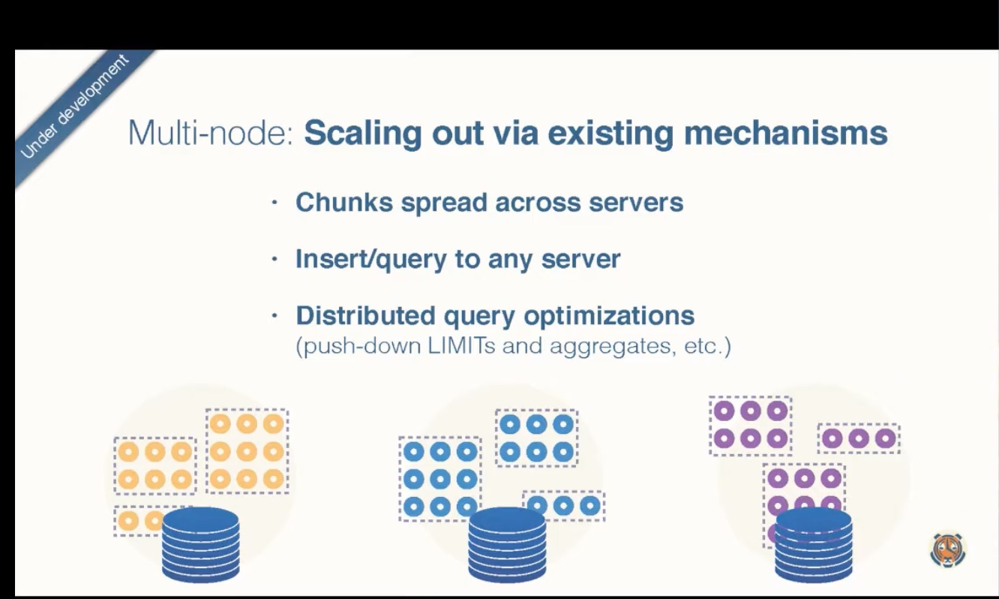

# Cassandra

## Cassandra Data Modeling

1. RDMS Modelling vs Cassandra Modelling
   1. It is an application database
   2. 
   3. 
2. Optimize for reads
   1. Design to get exactly the data that we want to get out
3. Data Model
   1. 
   2. Every row has a primary key made up of
      1. Partition Key (Required)
         1. this is what is used to partition data into different nodes in cluster
      2. Clustering Column (Optional)
         1. This is used to sort the data in the partition
         2. Uniquely identifies each row
   3. 
4. Dont Normalize!
   1. Try to follow store/retrieve data as such
   2. Allow redundancy
5. What if I normalize?
   1. Join at client
   2. Denormalize
6. Features
   1. Custom data types
   2. Collections as data type

## TimescaleDB

1. Time series database
   1. It has append heavy work loads
   2. Lot of writes per second
   3. Partition is done on time
2. TimescaleDB
   1. built on top of postgres
   2. automatic partitioning within seconds
   3. 
   4. 
3. Chunking
   1. It is easy to delete
   2. It is easy to index inside chunks
   3. Scale with disks
   4. 
   5. Parallel queries
   6. Distributed nodes
   7. 
